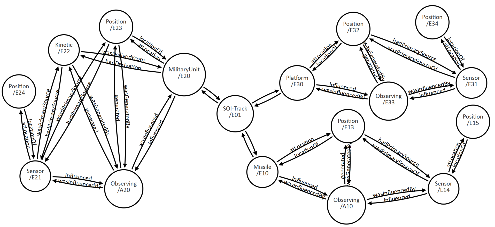

#Data Model Design
The data model design for SOI-Track-Datatype-2.0 enables the agile communication and processing of simple data sets.  These specialized data objects are associated at run-time to form a network graph of observation acts.  Since relationships between objects are set at run-time, the communicated message format tends to be flatter than data models having design-time associations between data components.  A flatter message format is lighter and generally simplifies processing to benefit many use-cases.

Observation acts include that which is observed, observors, and observation results.  These objects are first-class data components in SOI-Track-Datatype-2.0.  As first-class data components, they may be contained locally by an instance or remotely by another instance.  The components are associated by and described by linked-data.  Linked-data associations may refer to a local object in the message instance or a remote object in another instance.  

The above is possible because the intent of the SOI-Track-Datatype-2.0 data model is to describe data components that are more likelier to be:

  * autonomous, allowing objects to exist independently
  * self-contained, allowing objects to be represented as a whole
  * re-useable, allowing objects to be referenced rather than duplicated
  * modular, allowing objects to be re-used
  * mutable, allowing objects to change 
  
##Simple Data Sets
Simple data sets are specialized sets of data, such as military unit's organizational characteristics and measurement data, such as geospatial position.  More about the case for simple data sets can be referenced in [Simple, Agile Data Sets](./src/main/resources/documentation/simple-agile-data-sets.md).  

SOI-Track-Datatype-2.0 has enabled the ability for software components to communicate specialized sets of observation data.  A use-case may have one end-point capable of publishing a military unit's organizational characteristics and another end-point, let's say a sensor, capable of publishing measurement data such as geospatial position.  

As simple data sets are received, they are processed and assembled to describe an observation act over time.  The persistance of this associative data produces a network graph of observations scalable to other Information Object datatypes.

##Data Network Graph
A network graph of observation acts is formed by the association of simple data sets for that which is observed, the observor, and its observation results.  Observation acts may also be associated to a larger domain data set that includes other TSOA Information Object Datatype Objects.  
```
```
##Discovery and Search
Objects may be uniquely identified for identity, meaning, and association.  An identity identifier may categorically associate an object to a taxonomic category.  In addition, objects may be associated to Topics for topical searches.  Each identifier for identity, meaning, and association may participate in discovery and search capabilities.

```
    /-------------------\ <------------------------.
    |  Datatype-Object  | <-------.                 \
    \-------------------/          \                 |
              ^                     |                |
              |                     v                v
              |              /------------\    /---------\
              |              |  Category  |    |  Topic  |
              |              \------------/    \---------/
              |                   ^                ^
              v                   |                |
     /-----------------\         /                 |
     |  Simple-Object  | <------'                 /
     \-----------------/ <-----------------------'
```
###SOI Metadata Search Use-Case
A use case for SOI that leverages the capabilities of SOI-Track-Datatype-2.0 may be a metadata search service that returns data objects.  A first step may be to proscribe basic metadata vocabulary, something like Facebook did with OGP, for data object categorization.  This IEP contains proposed metadata vocabulary and usage examples.  Second, the basic metadata may be implemented by TSOA endpoints to produce metadata objects that are persisted in a SOI network graph datastore.  Last, the network graph datastore is searchable and returns matching metadata objects.

##First-Class Data Components
The SOI Track data model represents 3 top-level, first-class concepts:
```
     .................      ...............      ..................
    :  ObservedThing  :    :  Observation  :    :  ObservingThing  :
     .................      ...............      ..................
```
ObservedThing, Observation, and ObservingThing are abstract data components with multiple representations:
```
             .............................
            :         ObservedThing       :
             .............................
              ^            ^             ^
              |            |             |
       /--------\    /------------\    /-----------------------\
       |  Unit  |    |  Platform  |    |  Civil Demonstration  |
       \--------/    \------------/    \-----------------------/
```
```    
              .............................
             :         Observation         :
              .............................
               ^           ^            ^
               |           |            |
    /------------\    /----------\    /---------------\
    |  Position  |    |  Motion  |    |  Temperature  |
    \------------/    \----------/    \---------------/
```
```
             ..............................
            :        ObservingThing        :
             ..............................
              ^            ^             ^
              |            |             |
       /--------\     /----------\    /-------------\
       |  Unit  |     |  Sensor  |    |  Algorithm  |
       \--------/     \----------/    \-------------/
```
ObservedThing is a placeholder for entities and activities subject to observation acts.  For example, military units.  Each MilitaryUnit component contains characteristics assigned to that military unit, such as organizational affiliation.

Observation is a placeholder for collections of observation results.  Each collection contains observation results of the same type.  For example, a Position collection may contain estimated geo-spatial coordinates at discrete time instances for an ObservedThing or Sensor.  A Motion collection may contain estimated speed and bearing.

ObservingThing is a placeholder for collections of entities, instruments, algorithms and process chains.  For example, an Instrument component contains characteristics assigned to that instrument, such as its model and mounted platform.

##Linked Data
[Linked Data](https://en.wikipedia.org/wiki/Linked_data) is an approach to identifying things, relations, and concepts with HTTP URL URIs.  Computers may then evaluate and interpret such URLs for meaning, context, and associated data.  The URLs or hyper-links create a network of machine-interpretable data across different documents and HTTP services.

It's analogous to what we do as humans when we evaluate a web-page link in a document and decide whether to follow the link to get more context or related information about a topic.  For example, the following 15 minute video provides more context about linked data: 

[What is Linked Data?](https://www.youtube.com/watch?v=4x_xzT5eF5Q)

The SOI Track data model implements RDFa components to enable Linked Data.  The RDFa components may be set with semantic and de-referenceable URL values.  The values may be from general and domain specific vocabularies.  

For example, let's say a TSOA exchange requires the categorization of a data component instance.  To implement this requirement, a category property and its value may be simply identified by URLs in proscribed RDFa components.  The category property may be represented by a Class concept which is identified by and described at "http://schema.org/Class".  A Class categorization value may be identified by and described at "http://www.w3.org/ns/prov#Entity".  

The following notation depicts the data component instance categorization:   
```
  data-component.property."http://schema.org/Class" = "http://www.w3.org/ns/prov#Entity"
```
Additional meaning may be obtained by de-referencing the URLs (follow the links for meaning, context, and associated data). 

[Google Structured Data](https://developers.google.com/search/docs/guides/intro-structured-data) implements RDFa to 
link data and make content eligible for Google Search features such as Rich Cards, Breadcrumbs, Sitelinks Search Box, and Knowledge Graph cards.

Facebook’s OGP [Open Graph Protocol](http://ogp.me/) implements RDFa to link data and turn web pages into graph objects.  OGP “enables any web page to become a rich object in a social graph”, having “the same functionality as any other object on Facebook.”

##Contextual Metadata
Contextual metadata provides context for a data component instance.  The contextual metadata may: 

  1. Clarify a data component's content.

    For example, the following contextual metadata states that a military unit's classification is "Entity": 
```
  "http://mcsc.usmc.mil/mc2sa/tsoa/soi/track/2.0/soi-track/MilitaryUnit/idrootx2x0" 
     |
      `-- "http://schema.org/Class" 
            |
            `-- "http://www.w3.org/ns/prov#Entity".
```
  2. Associate a data component's relationship to other data components.

    For example, the following states that a military unit is at a location by associating a military unit to a position: 
```
  "http://mcsc.usmc.mil/mc2sa/tsoa/soi/track/2.0/soi-track/MilitaryUnit/idrootx2x0"
     |
      `-- "http://www.w3.org/ns/prov#atLocation"
            |
            `-- "http://mcsc.usmc.mil/mc2sa/tsoa/soi/track/2.0/soi-track/Position/idrootx5x0". 
```
The SOI Track data model represents meta-data components for all data components, regardless of their specificity.  Many times meta-data components are represented for larger, more general concepts.  But, smaller, more specific concepts, contained by larger, more general representations, often times do not have meta-data components.  As a work-around, the larger, more general representations may provide a way to enrich their smaller, more specific representations.  However, this approach may duplicate data, create irrelevant dependencies, and add wasteful complexities. 

##RDFa 
RDFa [Resource Description Framework in Attributes](https://en.wikipedia.org/wiki/RDFa) is a W3C Recommendation that defines a set of attribute-level data components for linking and expressing facts about data.  The set of attributes map to the W3C RDF data-model, thereby, enabling the embedding of RDF subject-predicate-object expressions within an XML document. 

[Google Structured Data](https://developers.google.com/search/docs/guides/intro-structured-data) specifies the usage of RDFa to make content eligible for Google Search features such as Rich Cards, Breadcrumbs, Sitelinks Search Box, and Knowledge Graph cards.

Facebook’s [Open Graph Protocol](http://ogp.me/) implements RDFa to turn web pages into graph objects.  OGP “enables any web page to become a rich object in a social graph”, having “the same functionality as any other object on Facebook.”

Facts expressed in a subject-predicate-object pattern are also known as triples.
 
##Semantic Triples
Semantic triples are expressions in a subject-predicate-object pattern that define intended structure and meaning.  

The triple pattern is foundational for W3C SPARQL-enabled [SPARQL Protocol and RDF Query Language](https://en.wikipedia.org/wiki/SPARQL) analytic and machine learning algorithms.  Several algorithms are able to consume large aggregations of triples from various sources.

##Example Instance
The following example depicts a simplified instance that is represented by a tree:
```
  SOI-Track
    |
    `-- MilitaryUnit (id="MilitaryUnit/001" 
    |       rdfa:rel="hasObservation hasObservation observedBy" rdfa:href="Position/001 Kinetic/001 Sensor/001")
    |
    `-- Platform (id="Platform/001" 
    |       rdfa:rel="hasObservation observedBy" rdfa:href="Position/002 Sensor/001")
    |
    `-- Missile (id="Missile/001" 
    |       rdfa:rel="hasObservation observedBy" rdfa:href="Position/003 Sensor/001")
    |
    `-- PositionCollection (id="Position/001" 
    |     |   rdfa:about="MilitaryUnit/001" rdfa:rel="bySensor" rdfa:href="Sensor/001")
    |     |
    |     `-- PositionEclipse (id="Position/001/PositionEclipse/001")
    |     |
    |     `-- PositionEclipse (id="Position/001/PositionEclipse/002")
    |
    `-- PositionCollection (id="Position/002" 
    |     |   rdfa:about="Platform/001" rdfa:rel="bySensor" rdfa:href="Sensor/002")
    |     |
    |     `-- PositionEclipse (id="Position/002/PositionEclipse/001")
    |
    `-- PositionCollection (id="Position/003" 
    |     |   rdfa:about="Missile/001" rdfa:rel="bySensor" rdfa:href="Sensor/003")
    |     |
    |     `-- PositionEclipse (id="Position/003/PositionEclipse/001")
    |
    `-- KineticCollection (id="Kinetic/001" 
    |     |   rdfa:about="MilitaryUnit/001" rdfa:rel="bySensor" rdfa:href="Sensor/001")
    |     |
    |     `-- KineticBearing (id="Kinetic/001/KineticBearing/001")
    |
    `-- Sensor (id="Sensor/001" 
    |       rdfa:rel="hasObservation hasObserved" rdfa:href="Position/003 MilitaryUnit/001")
    |
    `-- Sensor (id="Sensor/002"
    |       rdfa:rel="hasObservation hasObserved" rdfa:href="Position/002 Platform/001")
    |
    `-- Sensor (id="Sensor/003"
            rdfa:rel="hasObservation hasObserved" rdfa:href="Position/003 Missile/001")
```
As a data format, the instance represented above is fairly flat.  However, as a logical data model, the instance is deep and broad.  The instance implements the RDFa components to link related data components, forming a directional or network graph.  

The image below depicts the network graph data model represented by the above instance:


example-simplified-instance-directional-graph-data-model.PNG

##Flatter vs Deeper
The SOI Track data type deviates from the deep tree representation of many XML document formats.  The reason is that, in many cases, a flatter data format is simply easier and lighter to process (smaller stack, less objects).  Furthermore, a flatter data format is more flexible and adaptable to use-cases.  

For example, consider the following simple abstract data format model:
```
  SOI-Track
    |
    `-- [ObservedThing]
      |
      `-- [ObservationResult] (id, refid)
      |
      `-- Sensor (id, refid)
```
Based on this data format model, a typical sequence to process an observation act may be described as follows:

```
  for each ObservedThing, 
    do ObservedThing, ObservationResults, and Sensors.
```

A typical sequence to process only sensors may be described as follows:

```
  for each ObservedThing, 
    do Sensors.
```

Notice that each ObservedThing is transversed to obtain and process sensors.

For contrast, we have the following flatter data format modeled with three first-class data components:  
```
  SOI-Track
    |
    `-- [ObservedThing] (id rdfa:rel rdfa:href)
    |
    `-- [ObservationResult] (id rdfa:rel rdfa:href rdfa:about)
    |
    `-- Sensor (id rdfa:rel rdfa:href)
```
Based on this data format model, a typical sequence to process an observation act may be described as follows:

```
  do ObservedThings, ObservationResults, and Sensors.
```

A typical sequence to process only sensors may be described as follows:

```
  do Sensors
```

Although this is a basic example, notice how much simpler and lighter it is to process only sensors?  Since Sensor is a first-class data component, sensors may be processed exclusively and discretely.  The involvement of irrelevant data component trees is mitigated. 

The flatter data format is not only simpler and lighter, it is also more flexible and adaptable.

Let's say another use case is to only process recent observation results, the sequence of steps may be described as follows:

```
  for each [ObservationResult] do [ObservationResult] if timestamp > 2 hours ago )
```

Since ObservationResult is also a first-class data component, observation results may also be processed exclusively and discretely.  

Therefore, the SOI Track data type purposely deviates from the deep tree representation common in many XML document formats.  The rational is that flatter formats are simpler and lighter for processing, and more flexible and adaptable to use-cases.  

Last, but not the least, there are other significant reasons for a flatter data model and format.  For example, a flatter data format is friendlier for JSON transformations.  And, a flatter data model produces a smaller stack and less objects when processing, thereby improving memory requirements and overall performance.

#Conclusion
The data model design for SOI-Track-Datatype-2.0 describes data components that are likelier to be autonomous, self-contained, re-useable, modular, and mutable.  These characteristics are needed to enable the agile communication of simple data sets and flatter, lighter message formats.  
