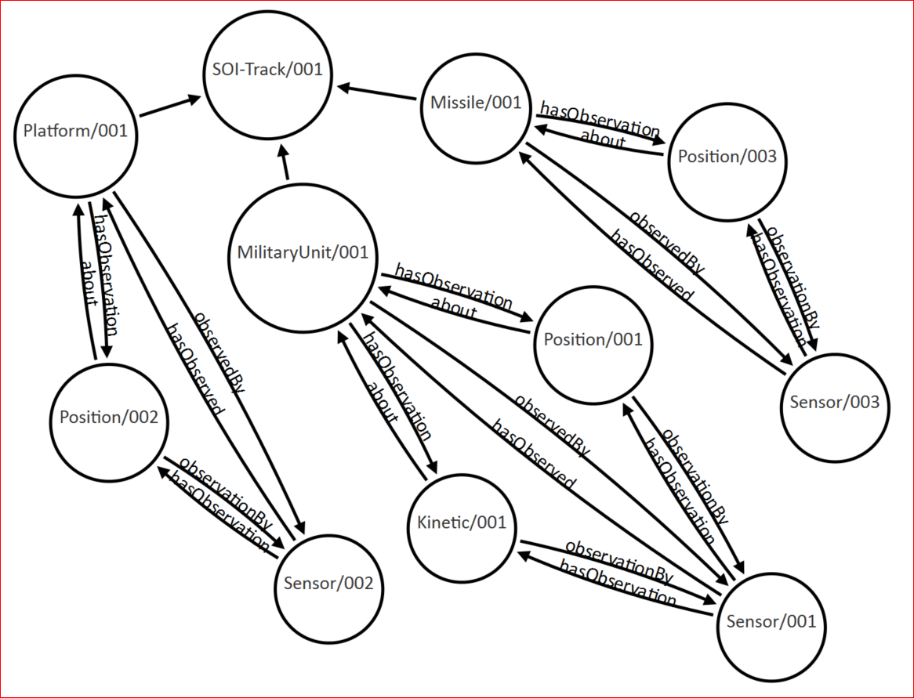

#Data Model Design
The motivations behind this data model design are the following:

  * demand for a simpler, more flexible contract for heterogeneous end-points
  * benefit of standardized contextual content to mitigate ambiguity and increase interoperability
  * demand for a flatter data model that is easier and lighter to process and more flexible and adaptable to use-cases
  * benefit of isolating generally stale data from fresh data
  * benefit of documentation in generated Java Classes 

The influence of these motivations is best described by the following differentiating topics:

  * First-Class Data Components
  * Linked-Data
  * Contextual Metadata
  * RDFa
  * Semantic Triples
  * Interoperable Data Nodes
  * Example Instance
  * Flatter vs. Deeper
  
##First-Class Data Components
The SOI Track data model represents 3 top-level, first-class concepts:
```
     .................      ...............      ..........
    :  ObservedThing  :    :  Observation  :    :  Sensor  :
     .................      ...............      ..........
```
ObservedThing, Observation, and Sensor are abstract data components with multiple representations:
```
             ..............................
            :         ObservedThing       :
             ..............................
              ^            ^             ^
              |            |             |
       /--------\    /------------\    /-----------------------\
       |  Unit  |    |  Platform  |    |  Civil Demonstration  |
       \--------/    \------------/    \-----------------------/
```
```    
              .............................
             :         Observation         :
              .............................
               ^           ^            ^
               |           |            |
    /------------\    /----------\    /---------------\
    |  Position  |    |  Motion  |    |  Temperature  |
    \------------/    \----------/    \---------------/
```
```
             ..............................
            :           Sensor             :
             ..............................
              ^            ^             ^
              |            |             |
       /--------\    /------------\    /--------------\
       |  Unit  |    |  Platform  |    |  Instrument  |
       \--------/    \------------/    \--------------/
```

ObservedThing is a placeholder for entities and activities subject to observation acts.  For example, military units.  Each MilitaryUnit component contains characteristics assigned to that military unit, such as organizational affiliation.

Observation is a placeholder for collections of observation results.  Each collection contains observation results of the same type.  For example, a Position collection may contain estimated geo-spatial coordinates at discrete time instances for an ObservedThing or Sensor.  A Motion collection may contain estimated speed and bearing.

Sensor is a placeholder for collections of entities, instruments, algorithms and process chains.  For example, an Instrument component contains characteristics assigned to that instrument, such as its model and mounted platform.

##Linked Data
[Linked Data](https://en.wikipedia.org/wiki/Linked_data) is an approach to naming things, relations, and concepts using de-referenceable HTTP URLs.  De-referenceable URLs are then available for computers to evaluate and interpret for meaning, context, and associated data.  The URLs create a network of standards-based machine-interpretable data across different documents and HTTP services.

It's analogous to what we do as humans when we evaluate a web-page link in a document and decide whether to follow the link to get more context or related information about a topic.  For example, the following 15 minute video provides more context about linked data: 

[What is Linked Data?](https://www.youtube.com/watch?v=4x_xzT5eF5Q)

The SOI Track data model implements RDFa components to enable Linked Data.  The RDFa components may be set with semantic and de-referenceable URL values to name things, provide additional context, and assert associations.  De-referenceable URLs provide a way for the evaluation and interpretation by computers for more context and related information.  

[Google Structured Data](https://developers.google.com/search/docs/guides/intro-structured-data) implements RDFa to 
link data and make content eligible for Google Search features such as Rich Cards, Breadcrumbs, Sitelinks Search Box, and Knowledge Graph cards.

Facebook’s OGP [Open Graph Protocol](http://ogp.me/) implements RDFa to link data and turn web pages into graph objects.  OGP “enables any web page to become a rich object in a social graph”, having “the same functionality as any other object on Facebook.”

###What's in it for SOI?
A start for SOI may be to first define basic metadata vocabulary, following Facebook's start with OGP.  Second, the basic metadata may be implemented by TSOA endpoints to produce nodes in a SOI network graph datastore.  And last, the network graph datastore is searchable by the TSOA community to produce direct hits into the SOI Information Object Repository with record-ids. 

##Contextual Metadata
A data component's meta-data provides context for an instance.  It's contextual content may 

  1. clarify a data component's content: `ObservedThing/001 isA activity/patrol`
  2. identify and associate a data component's relationship to other data components: `Sensor/001 hasObserved MilitaryUnit/001`. 
 
The SOI Track data model represents meta-data components for all data components, regardless of their specificity.  Many times meta-data components are represented for larger, more general concepts.  But, smaller, more specific concepts, contained by larger, more general representations, often times do not have meta-data components.  As a work-around, the larger, more general representations may provide a way to enrich their smaller, more specific representations.  However, this approach may duplicate data, create irrelevant dependencies, and add wasteful complexities. 

The placement of contextual metadata within a node's context follows best-practice design principles for interoperability:

  * autonomy - may exist independently
  * self-containment - may be represented as a whole
  * re-use - values are not duplicated
  * modularity - may be re-used
  * evolvability - may change 
  
The SOI Track data model implements RDFa as its meta-data components.  RDFa data components are inherent to each data component described by the SOI Track data model.

##RDFa 
RDFa [Resource Description Framework in Attributes](https://en.wikipedia.org/wiki/RDFa) is a W3C Recommendation that defines a set of attribute-level data components for linking and expressing facts about data.  The set of attributes map to the W3C RDF data-model, thereby, enabling the embedding of RDF subject-predicate-object expressions within an XML document. 

[Google Structured Data](https://developers.google.com/search/docs/guides/intro-structured-data) specifies the usage of RDFa to make content eligible for Google Search features such as Rich Cards, Breadcrumbs, Sitelinks Search Box, and Knowledge Graph cards.

Facebook’s [Open Graph Protocol](http://ogp.me/) implements RDFa to turn web pages into graph objects.  OGP “enables any web page to become a rich object in a social graph”, having “the same functionality as any other object on Facebook.”

Facts expressed in a subject-predicate-object pattern are also known as triples.
 
##Semantic Triples
Semantic triples are expressions in a subject-predicate-object pattern that define intended structure and meaning.  For example, `Sensor/001 hasObserved MilitaryUnit/001` and `MilitaryUnit/001 hasObservation Position/001`.

The triple pattern is foundational for W3C SPARQL-enabled [SPARQL Protocol and RDF Query Language](https://en.wikipedia.org/wiki/SPARQL) analytic and machine learning algorithms.  Several algorithms are able to consume large aggregations of triples from various sources.

##Example Instance
The following example depicts a simplified instance that is represented by a tree:
```
  SOI-Track
    |
    `-- MilitaryUnit (id="MilitaryUnit/001" 
    |       rdfa:rel="hasObservation hasObservation observedBy" rdfa:href="Position/001 Kinetic/001 Sensor/001")
    |
    `-- Platform (id="Platform/001" 
    |       rdfa:rel="hasObservation observedBy" rdfa:href="Position/002 Sensor/001")
    |
    `-- Missile (id="Missile/001" 
    |       rdfa:rel="hasObservation observedBy" rdfa:href="Position/003 Sensor/001")
    |
    `-- PositionCollection (id="Position/001" 
    |     |   rdfa:about="MilitaryUnit/001" rdfa:rel="bySensor" rdfa:href="Sensor/001")
    |     |
    |     `-- PositionEclipse (id="Position/001/PositionEclipse/001")
    |     |
    |     `-- PositionEclipse (id="Position/001/PositionEclipse/002")
    |
    `-- PositionCollection (id="Position/002" 
    |     |   rdfa:about="Platform/001" rdfa:rel="bySensor" rdfa:href="Sensor/002")
    |     |
    |     `-- PositionEclipse (id="Position/002/PositionEclipse/001")
    |
    `-- PositionCollection (id="Position/003" 
    |     |   rdfa:about="Missile/001" rdfa:rel="bySensor" rdfa:href="Sensor/003")
    |     |
    |     `-- PositionEclipse (id="Position/003/PositionEclipse/001")
    |
    `-- KineticCollection (id="Kinetic/001" 
    |     |   rdfa:about="MilitaryUnit/001" rdfa:rel="bySensor" rdfa:href="Sensor/001")
    |     |
    |     `-- KineticBearing (id="Kinetic/001/KineticBearing/001")
    |
    `-- Sensor (id="Sensor/001" 
    |       rdfa:rel="hasObservation hasObserved" rdfa:href="Position/003 MilitaryUnit/001")
    |
    `-- Sensor (id="Sensor/002"
    |       rdfa:rel="hasObservation hasObserved" rdfa:href="Position/002 Platform/001")
    |
    `-- Sensor (id="Sensor/003"
            rdfa:rel="hasObservation hasObserved" rdfa:href="Position/003 Missile/001")
```
As a data format, the instance represented above is fairly flat.  However, as a logical data model, the instance is deep and broad.  The instance implements the RDFa components to link related data components, forming a directional or network graph.  

The image below depicts the network graph data model represented by the above instance:


example-simplified-instance-directional-graph-data-model_006.PNG

##Flatter vs Deeper
The SOI Track data type deviates from the deep tree representation of many XML document formats.  The reason is that, in many cases, a flatter data format is simply easier and lighter to process (smaller stack, less objects).  Furthermore, a flatter data format is more flexible and adaptable to use-cases.  

For example, consider the following simple abstract data format model:
```
  SOI-Track
    |
    `-- [ObservedThing]
      |
      `-- [ObservationResult] (id, refid)
      |
      `-- Sensor (id, refid)
```
Based on this data format model, a typical sequence to process an observation act may be described as follows:

```
  for each ObservedThing, 
    do ObservedThing, ObservationResults, and Sensors.
```

A typical sequence to process only sensors may be described as follows:

```
  for each ObservedThing, 
    do Sensors.
```

Notice that each ObservedThing is transversed to obtain and process sensors.

For contrast, we have the following flatter data format modeled with three first-class data components:  
```
  SOI-Track
    |
    `-- [ObservedThing] (id rdfa:rel rdfa:href)
    |
    `-- [ObservationResult] (id rdfa:rel rdfa:href rdfa:about)
    |
    `-- Sensor (id rdfa:rel rdfa:href)
```
Based on this data format model, a typical sequence to process an observation act may be described as follows:

```
  do ObservedThings, ObservationResults, and Sensors.
```

A typical sequence to process only sensors may be described as follows:

```
  do Sensors
```

Although this is a basic example, notice how much simpler and lighter it is to process only sensors?  Since Sensor is a first-class data component, sensors may be processed exclusively and discretely.  The involvement of irrelevant data component trees is mitigated. 

The flatter data format is not only simpler and lighter, it is also more flexible and adaptable.

Let's say another use case is to only process recent observation results, the sequence of steps may be described as follows:

```
  for each [ObservationResult] do [ObservationResult] if timestamp > 2 hours ago )
```

Since ObservationResult is also a first-class data component, observation results may also be processed exclusively and discretely.  

Therefore, the SOI Track data type purposely deviates from the deep tree representation common in many XML document formats.  The rational is that flatter formats are simpler and lighter for processing, and more flexible and adaptable to use-cases.  

Last, but not the least, there are other significant reasons for a flatter data model and format.  For example, a flatter data format is friendlier for JSON transformations.  And, a flatter data model produces a smaller stack and less objects when processing, thereby improving memory requirements and overall performance.

###end of human content
 
<!-- 0.6 -->

<ul data-external-scale="1" data-internal-scale="0.26" class="graph-diagram-markup">
  <li data-y="0" data-x="0" data-node-id="0" class="node"></li>
  <li data-y="0" data-x="0" data-node-id="1" class="node"></li>
  <li data-y="4372.466422466416" data-x="844.2002442002411" data-node-id="2" class="node">
    <span class="caption">Position/002</span>
  </li>
  <li data-y="2409.7557997557997" data-x="2860.3174603174707" data-node-id="3" class="node">
    <span class="caption">MilitaryUnit/001</span>
  </li>
  <li data-y="0" data-x="0" data-node-id="4" class="node"></li>
  <li data-y="1351.7155067155145" data-x="709.5848595848563" data-node-id="5" class="node">
    <span class="caption">Platform/001</span>
  </li>
  <li data-y="700.5286935286922" data-x="2608.3748473748346" data-node-id="6" class="node">
    <span class="caption">SOI-Track/001</span>
  </li>
  <li data-y="3368.7521367521344" data-x="5841.427350427342" data-node-id="7" class="node">
    <span class="caption">Position/001</span>
  </li>
  <li data-y="0" data-x="0" data-node-id="8" class="node"></li>
  <li data-y="990.7404144412025" data-x="4586.497859096282" data-node-id="9" class="node">
    <span class="caption">Missile/001</span>
  </li>
  <li data-y="5441.025641025651" data-x="4632.051282051295" data-node-id="10" class="node">
    <span class="caption">Kinetic/001</span>
  </li>
  <li data-y="6412.087912087907" data-x="7670.512820512822" data-node-id="11" class="node">
    <span class="caption">Sensor/001</span>
  </li>
  <li data-y="1598.1684981685044" data-x="7280.769230769244" data-node-id="13" class="node">
    <span class="caption">Position/003</span>
  </li>
  <li data-y="4220.007326007328" data-x="8470.87912087911" data-node-id="14" class="node">
    <span class="caption">Sensor/003</span>
  </li>
  <li data-y="6060.589743589729" data-x="2959.1538461538507" data-node-id="15" class="node">
    <span class="caption">Sensor/002</span>
  </li>
  <li data-to="5" data-from="2" class="relationship">
    <span class="type">about</span>
  </li>
  <li data-to="6" data-from="3" class="relationship"></li>
  <li data-to="6" data-from="5" class="relationship"></li>
  <li data-to="6" data-from="9" class="relationship"></li>
  <li data-to="3" data-from="7" class="relationship">
    <span class="type">about</span>
  </li>
  <li data-to="3" data-from="10" class="relationship">
    <span class="type">about</span>
  </li>
  <li data-to="11" data-from="7" class="relationship">
    <span class="type">observationBy</span>
  </li>
  <li data-to="14" data-from="13" class="relationship">
    <span class="type">observationBy</span>
  </li>
  <li data-to="9" data-from="13" class="relationship">
    <span class="type">about</span>
  </li>
  <li data-to="11" data-from="10" class="relationship">
    <span class="type">observationBy</span>
  </li>
  <li data-to="15" data-from="2" class="relationship">
    <span class="type">observationBy</span>
  </li>
  <li data-to="9" data-from="14" class="relationship">
    <span class="type">hasObserved</span>
  </li>
  <li data-to="13" data-from="14" class="relationship">
    <span class="type">hasObservation</span>
  </li>
  <li data-to="13" data-from="9" class="relationship">
    <span class="type">hasObservation</span>
  </li>
  <li data-to="14" data-from="9" class="relationship">
    <span class="type">observedBy</span>
  </li>
  <li data-to="7" data-from="3" class="relationship">
    <span class="type">hasObservation</span>
  </li>
  <li data-to="10" data-from="3" class="relationship">
    <span class="type">hasObservation</span>
  </li>
  <li data-to="2" data-from="5" class="relationship">
    <span class="type">hasObservation</span>
  </li>
  <li data-to="7" data-from="11" class="relationship">
    <span class="type">hasObservation</span>
  </li>
  <li data-to="10" data-from="11" class="relationship">
    <span class="type">hasObservation</span>
  </li>
  <li data-to="2" data-from="15" class="relationship">
    <span class="type">hasObservation</span>
  </li>
  <li data-to="11" data-from="3" class="relationship">
    <span class="type">observedBy</span>
  </li>
  <li data-to="3" data-from="11" class="relationship">
    <span class="type">hasObserved</span>
  </li>
  <li data-to="5" data-from="15" class="relationship">
    <span class="type">hasObserved</span>
  </li>
  <li data-to="15" data-from="5" class="relationship">
    <span class="type">observedBy</span>
  </li>
</ul>


CREATE 
  (`0` :Node ) ,
  (`1` :Node ) ,
  (`2` :`Position/002` ) ,
  (`3` :`MilitaryUnit/001` ) ,
  (`4` :Node ) ,
  (`5` :`Platform/001` ) ,
  (`6` :`SOI-Track/001` ) ,
  (`7` :`Position/001` ) ,
  (`8` :Node ) ,
  (`9` :`Missile/001` ) ,
  (`10` :`Kinetic/001` ) ,
  (`11` :`Sensor/001` ) ,
  (`13` :`Position/003` ) ,
  (`14` :`Sensor/003` ) ,
  (`15` :`Sensor/002` ) ,
  (`2`)-[:`about`]->(`5`),
  (`3`)-[:`RELATED_TO`]->(`6`),
  (`5`)-[:`RELATED_TO`]->(`6`),
  (`9`)-[:`RELATED_TO`]->(`6`),
  (`7`)-[:`about`]->(`3`),
  (`10`)-[:`about`]->(`3`),
  (`7`)-[:`observationBy`]->(`11`),
  (`13`)-[:`observationBy`]->(`14`),
  (`13`)-[:`about`]->(`9`),
  (`10`)-[:`observationBy`]->(`11`),
  (`2`)-[:`observationBy`]->(`15`),
  (`14`)-[:`hasObserved`]->(`9`),
  (`14`)-[:`hasObservation`]->(`13`),
  (`9`)-[:`hasObservation`]->(`13`),
  (`9`)-[:`observedBy`]->(`14`),
  (`3`)-[:`hasObservation`]->(`7`),
  (`3`)-[:`hasObservation`]->(`10`),
  (`5`)-[:`hasObservation`]->(`2`),
  (`11`)-[:`hasObservation`]->(`7`),
  (`11`)-[:`hasObservation`]->(`10`),
  (`15`)-[:`hasObservation`]->(`2`),
  (`3`)-[:`observedBy`]->(`11`),
  (`11`)-[:`hasObserved`]->(`3`),
  (`15`)-[:`hasObserved`]->(`5`),
  (`5`)-[:`observedBy`]->(`15`)
  

<!-- 0.5 -->

<ul data-external-scale="1" data-internal-scale="0.26" class="graph-diagram-markup">
  <li data-y="0" data-x="0" data-node-id="0" class="node"></li>
  <li data-y="0" data-x="0" data-node-id="1" class="node"></li>
  <li data-y="3780.158730158724" data-x="1205.738705738703" data-node-id="2" class="node">
    <span class="caption">Position</span>
  </li>
  <li data-y="2482.832722832724" data-x="2783.3943833943904" data-node-id="3" class="node">
    <span class="caption">MilitaryUnit</span>
  </li>
  <li data-y="0" data-x="0" data-node-id="4" class="node"></li>
  <li data-y="1663.253968253975" data-x="993.6349206349233" data-node-id="5" class="node">
    <span class="caption">Platform</span>
  </li>
  <li data-y="646.6825396825384" data-x="2500.682539682528" data-node-id="6" class="node">
    <span class="caption">SOI-Track</span>
  </li>
  <li data-y="3461.0598290598214" data-x="4729.888888888872" data-node-id="7" class="node">
    <span class="caption">Position</span>
  </li>
  <li data-y="0" data-x="0" data-node-id="8" class="node"></li>
  <li data-y="1306.1250298258165" data-x="4163.420936019359" data-node-id="9" class="node">
    <span class="caption">Missile</span>
  </li>
  <li data-y="4417.94871794871" data-x="3447.4358974358956" data-node-id="10" class="node">
    <span class="caption">Kinetic</span>
  </li>
  <li data-y="4146.703296703293" data-x="7262.820512820497" data-node-id="11" class="node">
    <span class="caption">Sensor/001</span>
  </li>
  <li data-y="2790.4761904761926" data-x="5799.999999999999" data-node-id="13" class="node">
    <span class="caption">Position</span>
  </li>
  <li data-y="1531.5457875457862" data-x="7547.802197802171" data-node-id="14" class="node">
    <span class="caption">Sensor/003</span>
  </li>
  <li data-y="5887.51282051281" data-x="3305.3076923076974" data-node-id="15" class="node">
    <span class="caption">Sensor/002</span>
  </li>
  <li data-to="5" data-from="2" class="relationship">
    <span class="type">about</span>
  </li>
  <li data-to="6" data-from="3" class="relationship"></li>
  <li data-to="6" data-from="5" class="relationship"></li>
  <li data-to="6" data-from="9" class="relationship"></li>
  <li data-to="3" data-from="7" class="relationship">
    <span class="type">about</span>
  </li>
  <li data-to="3" data-from="10" class="relationship">
    <span class="type">about</span>
  </li>
  <li data-to="11" data-from="7" class="relationship">
    <span class="type">bySensor</span>
  </li>
  <li data-to="14" data-from="13" class="relationship">
    <span class="type">bySensor</span>
  </li>
  <li data-to="9" data-from="13" class="relationship">
    <span class="type">about</span>
  </li>
  <li data-to="11" data-from="10" class="relationship">
    <span class="type">bySensor</span>
  </li>
  <li data-to="15" data-from="2" class="relationship">
    <span class="type">bySensor</span>
  </li>
</ul>

data:image/svg+xml;base64,PHN2ZyB4bWxucz0iaHR0cDovL3d3dy53My5vcmcvMjAwMC9zdmciIGNsYXNzPSJncmFwaGRpYWdyYW0iIHZpZXdCb3g9Ik5hTiBOYU4gTmFOIE5hTiI+PGcgY2xhc3M9ImxheWVyIHJlbGF0aW9uc2hpcHMiPjxnIGNsYXNzPSJyZWxhdGVkLXBhaXIiPjxnIGNsYXNzPSJyZWxhdGlvbnNoaXAiIHRyYW5zZm9ybT0idHJhbnNsYXRlKDE5Ni42NjY2NjY2NjY2NjYxNyw3NjEuNTUzMzMzMzMzMzMxNSkgcm90YXRlKC04OC4zMzMyMTc0MDkxOTY1OCkiPjxwYXRoIGNsYXNzPSJyZWxhdGlvbnNoaXAiIGQ9Ik0gMTE4Ljc3MDI3NzgxMDA5MDk2IDQgTCAyNTUuOTIzNzkzMDI2MDE3OCA0IEwgMjU1LjkyMzc5MzAyNjAxNzggMTYgTCAyODcuOTIzNzkzMDI2MDE3OCAwIEwgMjU1LjkyMzc5MzAyNjAxNzggLTE2IEwgMjU1LjkyMzc5MzAyNjAxNzggLTQgTCAxMTguNzcwMjc3ODEwMDkwOTYgLTQgWiIgZmlsbD0icmdiKDAsIDAsIDApIiBzdHJva2U9InJnYig1MSwgNTEsIDUxKSIgc3Ryb2tlLXdpZHRoPSIwcHgiLz48dGV4dCBjbGFzcz0idHlwZSIgdGV4dC1hbmNob3I9Im1pZGRsZSIgYmFzZWxpbmUtc2hpZnQ9IjMwJSIgYWxpZ25tZW50LWJhc2VsaW5lPSJhbHBoYWJldGljIiB4PSIxODcuMzQ3MDM1NDE4MDU0MzYiIHk9IjAiIGZvbnQtc2l6ZT0iNTBweCIgZm9udC1mYW1pbHk9IiZxdW90O0dpbGwgU2FucyZxdW90OywmcXVvdDtHaWxsIFNhbnMgTVQmcXVvdDssQ2FsaWJyaSxzYW5zLXNlcmlmIj5hYm91dDwvdGV4dD48L2c+PC9nPjxnIGNsYXNzPSJyZWxhdGVkLXBhaXIiPjxnIGNsYXNzPSJyZWxhdGlvbnNoaXAiIHRyYW5zZm9ybT0idHJhbnNsYXRlKDU4NC41MTI4MjA1MTI4MjE5LDUyMS4zOTQ4NzE3OTQ4NzIpIHJvdGF0ZSgtOTguNzUzMDg3ODMzMjk0MDkpIj48cGF0aCBjbGFzcz0icmVsYXRpb25zaGlwIiBkPSJNIDE1Ny41NTU2NTU0NzU1NzkxIDQgTCAyMjYuMzg0MzY0Mjk1NTIwNzUgNCBMIDIyNi4zODQzNjQyOTU1MjA3NSAxNiBMIDI1OC4zODQzNjQyOTU1MjA3NSAwIEwgMjI2LjM4NDM2NDI5NTUyMDc1IC0xNiBMIDIyNi4zODQzNjQyOTU1MjA3NSAtNCBMIDE1Ny41NTU2NTU0NzU1NzkxIC00IFoiIGZpbGw9InJnYigwLCAwLCAwKSIgc3Ryb2tlPSJyZ2IoNTEsIDUxLCA1MSkiIHN0cm9rZS13aWR0aD0iMHB4Ii8+PC9nPjwvZz48ZyBjbGFzcz0icmVsYXRlZC1wYWlyIj48ZyBjbGFzcz0icmVsYXRpb25zaGlwIiB0cmFuc2Zvcm09InRyYW5zbGF0ZSgyMDguNjYzMzMzMzMzMzMzOSwzNDkuMjgzMzMzMzMzMzM0Nykgcm90YXRlKC0zNC4wMDE0MzY0Njc5NzQ5NykiPjxwYXRoIGNsYXNzPSJyZWxhdGlvbnNoaXAiIGQ9Ik0gMTI0LjUyMDcxNTg2MTA2Njg1IDQgTCAyMTcuOTk5MzUzMDQwNTUwNjMgNCBMIDIxNy45OTkzNTMwNDA1NTA2MyAxNiBMIDI0OS45OTkzNTMwNDA1NTA2MyAwIEwgMjE3Ljk5OTM1MzA0MDU1MDYzIC0xNiBMIDIxNy45OTkzNTMwNDA1NTA2MyAtNCBMIDEyNC41MjA3MTU4NjEwNjY4NSAtNCBaIiBmaWxsPSJyZ2IoMCwgMCwgMCkiIHN0cm9rZT0icmdiKDUxLCA1MSwgNTEpIiBzdHJva2Utd2lkdGg9IjBweCIvPjwvZz48L2c+PGcgY2xhc3M9InJlbGF0ZWQtcGFpciI+PGcgY2xhc3M9InJlbGF0aW9uc2hpcCIgdHJhbnNmb3JtPSJ0cmFuc2xhdGUoODc0LjMxODM5NjU2NDA2NTMsMjc0LjI4NjI1NjI2MzQyMTQpIHJvdGF0ZSgtMTU4LjM2NjcwOTg5MjY3MTg4KSI+PHBhdGggY2xhc3M9InJlbGF0aW9uc2hpcCIgZD0iTSAxMDguODAxNDAzNzMwMTQzOTkgNCBMIDIxMS44ODI4MzE2Mzg0NjE1IDQgTCAyMTEuODgyODMxNjM4NDYxNSAxNiBMIDI0My44ODI4MzE2Mzg0NjE1IDAgTCAyMTEuODgyODMxNjM4NDYxNSAtMTYgTCAyMTEuODgyODMxNjM4NDYxNSAtNCBMIDEwOC44MDE0MDM3MzAxNDM5OSAtNCBaIiBmaWxsPSJyZ2IoMCwgMCwgMCkiIHN0cm9rZT0icmdiKDUxLCA1MSwgNTEpIiBzdHJva2Utd2lkdGg9IjBweCIvPjwvZz48L2c+PGcgY2xhc3M9InJlbGF0ZWQtcGFpciI+PGcgY2xhc3M9InJlbGF0aW9uc2hpcCIgdHJhbnNmb3JtPSJ0cmFuc2xhdGUoOTkzLjI3NjY2NjY2NjY2MzEsNzYxLjU1MzMzMzMzMzMzMTUpIHJvdGF0ZSgtMTQ5LjU2NDc1MzI5NDA2NTcyKSI+PHBhdGggY2xhc3M9InJlbGF0aW9uc2hpcCIgZD0iTSAxMTguNzcwMjc3ODEwMDkwOTYgNCBMIDI4NC41MzcxMjkyOTQ0NDk3NiA0IEwgMjg0LjUzNzEyOTI5NDQ0OTc2IDE2IEwgMzE2LjUzNzEyOTI5NDQ0OTc2IDAgTCAyODQuNTM3MTI5Mjk0NDQ5NzYgLTE2IEwgMjg0LjUzNzEyOTI5NDQ0OTc2IC00IEwgMTE4Ljc3MDI3NzgxMDA5MDk2IC00IFoiIGZpbGw9InJnYigwLCAwLCAwKSIgc3Ryb2tlPSJyZ2IoNTEsIDUxLCA1MSkiIHN0cm9rZS13aWR0aD0iMHB4Ii8+PHRleHQgY2xhc3M9InR5cGUiIHRleHQtYW5jaG9yPSJtaWRkbGUiIGJhc2VsaW5lLXNoaWZ0PSIzMCUiIGFsaWdubWVudC1iYXNlbGluZT0iYWxwaGFiZXRpYyIgdHJhbnNmb3JtPSJyb3RhdGUoMTgwKSIgeD0iLTIwMS42NTM3MDM1NTIyNzAzNyIgeT0iMCIgZm9udC1zaXplPSI1MHB4IiBmb250LWZhbWlseT0iJnF1b3Q7R2lsbCBTYW5zJnF1b3Q7LCZxdW90O0dpbGwgU2FucyBNVCZxdW90OyxDYWxpYnJpLHNhbnMtc2VyaWYiPmFib3V0PC90ZXh0PjwvZz48L2c+PGcgY2xhc3M9InJlbGF0ZWQtcGFpciI+PGcgY2xhc3M9InJlbGF0aW9uc2hpcCIgdHJhbnNmb3JtPSJ0cmFuc2xhdGUoNzQ4Ljk5OTk5OTk5OTk5OTQsOTcyLjk5OTk5OTk5OTk5ODUpIHJvdGF0ZSgtMTEwLjAxMzAzNDIyMzA1Njc0KSI+PHBhdGggY2xhc3M9InJlbGF0aW9uc2hpcCIgZD0iTSAxMDYuOTE5NDc2MTM2MzUxOTUgNCBMIDI5MS4wNzIyOTIxNDc5NjAzNSA0IEwgMjkxLjA3MjI5MjE0Nzk2MDM1IDE2IEwgMzIzLjA3MjI5MjE0Nzk2MDM1IDAgTCAyOTEuMDcyMjkyMTQ3OTYwMzUgLTE2IEwgMjkxLjA3MjI5MjE0Nzk2MDM1IC00IEwgMTA2LjkxOTQ3NjEzNjM1MTk1IC00IFoiIGZpbGw9InJnYigwLCAwLCAwKSIgc3Ryb2tlPSJyZ2IoNTEsIDUxLCA1MSkiIHN0cm9rZS13aWR0aD0iMHB4Ii8+PHRleHQgY2xhc3M9InR5cGUiIHRleHQtYW5jaG9yPSJtaWRkbGUiIGJhc2VsaW5lLXNoaWZ0PSIzMCUiIGFsaWdubWVudC1iYXNlbGluZT0iYWxwaGFiZXRpYyIgdHJhbnNmb3JtPSJyb3RhdGUoMTgwKSIgeD0iLTE5OC45OTU4ODQxNDIxNTYxNyIgeT0iMCIgZm9udC1zaXplPSI1MHB4IiBmb250LWZhbWlseT0iJnF1b3Q7R2lsbCBTYW5zJnF1b3Q7LCZxdW90O0dpbGwgU2FucyBNVCZxdW90OyxDYWxpYnJpLHNhbnMtc2VyaWYiPmFib3V0PC90ZXh0PjwvZz48L2c+PGcgY2xhc3M9InJlbGF0ZWQtcGFpciI+PGcgY2xhc3M9InJlbGF0aW9uc2hpcCIgdHJhbnNmb3JtPSJ0cmFuc2xhdGUoOTkzLjI3NjY2NjY2NjY2MzEsNzYxLjU1MzMzMzMzMzMzMTUpIHJvdGF0ZSg1OS42OTkwNzA2NDQ3MTQ5NykiPjxwYXRoIGNsYXNzPSJyZWxhdGlvbnNoaXAiIGQ9Ik0gMTE4Ljc3MDI3NzgxMDA5MDk2IDQgTCAzMzAuNTk2MjExODkxNjU0NTUgNCBMIDMzMC41OTYyMTE4OTE2NTQ1NSAxNiBMIDM2Mi41OTYyMTE4OTE2NTQ1NSAwIEwgMzMwLjU5NjIxMTg5MTY1NDU1IC0xNiBMIDMzMC41OTYyMTE4OTE2NTQ1NSAtNCBMIDExOC43NzAyNzc4MTAwOTA5NiAtNCBaIiBmaWxsPSJyZ2IoMCwgMCwgMCkiIHN0cm9rZT0icmdiKDUxLCA1MSwgNTEpIiBzdHJva2Utd2lkdGg9IjBweCIvPjx0ZXh0IGNsYXNzPSJ0eXBlIiB0ZXh0LWFuY2hvcj0ibWlkZGxlIiBiYXNlbGluZS1zaGlmdD0iMzAlIiBhbGlnbm1lbnQtYmFzZWxpbmU9ImFscGhhYmV0aWMiIHg9IjIyNC42ODMyNDQ4NTA4NzI3NyIgeT0iMCIgZm9udC1zaXplPSI1MHB4IiBmb250LWZhbWlseT0iJnF1b3Q7R2lsbCBTYW5zJnF1b3Q7LCZxdW90O0dpbGwgU2FucyBNVCZxdW90OyxDYWxpYnJpLHNhbnMtc2VyaWYiPmJ5U2Vuc29yPC90ZXh0PjwvZz48L2c+PGcgY2xhc3M9InJlbGF0ZWQtcGFpciI+PGcgY2xhc3M9InJlbGF0aW9uc2hpcCIgdHJhbnNmb3JtPSJ0cmFuc2xhdGUoMTIxNy45OTk5OTk5OTk5OTk4LDU4Ni4wMDAwMDAwMDAwMDA1KSByb3RhdGUoNDcuNjg2Mjg0NzA3ODA0MDcpIj48cGF0aCBjbGFzcz0icmVsYXRpb25zaGlwIiBkPSJNIDExOC43NzAyNzc4MTAwOTA5NiA0IEwgMzU1LjA0OTQwMTc5MDg5MDggNCBMIDM1NS4wNDk0MDE3OTA4OTA4IDE2IEwgMzg3LjA0OTQwMTc5MDg5MDggMCBMIDM1NS4wNDk0MDE3OTA4OTA4IC0xNiBMIDM1NS4wNDk0MDE3OTA4OTA4IC00IEwgMTE4Ljc3MDI3NzgxMDA5MDk2IC00IFoiIGZpbGw9InJnYigwLCAwLCAwKSIgc3Ryb2tlPSJyZ2IoNTEsIDUxLCA1MSkiIHN0cm9rZS13aWR0aD0iMHB4Ii8+PHRleHQgY2xhc3M9InR5cGUiIHRleHQtYW5jaG9yPSJtaWRkbGUiIGJhc2VsaW5lLXNoaWZ0PSIzMCUiIGFsaWdubWVudC1iYXNlbGluZT0iYWxwaGFiZXRpYyIgeD0iMjM2LjkwOTgzOTgwMDQ5MDkiIHk9IjAiIGZvbnQtc2l6ZT0iNTBweCIgZm9udC1mYW1pbHk9IiZxdW90O0dpbGwgU2FucyZxdW90OywmcXVvdDtHaWxsIFNhbnMgTVQmcXVvdDssQ2FsaWJyaSxzYW5zLXNlcmlmIj5ieVNlbnNvcjwvdGV4dD48L2c+PC9nPjxnIGNsYXNzPSJyZWxhdGVkLXBhaXIiPjxnIGNsYXNzPSJyZWxhdGlvbnNoaXAiIHRyYW5zZm9ybT0idHJhbnNsYXRlKDEyMTcuOTk5OTk5OTk5OTk5OCw1ODYuMDAwMDAwMDAwMDAwNSkgcm90YXRlKC0xMzcuNzkyNDcxNjgwNjE0NDMpIj48cGF0aCBjbGFzcz0icmVsYXRpb25zaGlwIiBkPSJNIDExOC43NzAyNzc4MTAwOTA5NiA0IEwgMzIzLjE4NDA1MTQwMjQxNTY2IDQgTCAzMjMuMTg0MDUxNDAyNDE1NjYgMTYgTCAzNTUuMTg0MDUxNDAyNDE1NjYgMCBMIDMyMy4xODQwNTE0MDI0MTU2NiAtMTYgTCAzMjMuMTg0MDUxNDAyNDE1NjYgLTQgTCAxMTguNzcwMjc3ODEwMDkwOTYgLTQgWiIgZmlsbD0icmdiKDAsIDAsIDApIiBzdHJva2U9InJnYig1MSwgNTEsIDUxKSIgc3Ryb2tlLXdpZHRoPSIwcHgiLz48dGV4dCBjbGFzcz0idHlwZSIgdGV4dC1hbmNob3I9Im1pZGRsZSIgYmFzZWxpbmUtc2hpZnQ9IjMwJSIgYWxpZ25tZW50LWJhc2VsaW5lPSJhbHBoYWJldGljIiB0cmFuc2Zvcm09InJvdGF0ZSgxODApIiB4PSItMjIwLjk3NzE2NDYwNjI1MzMzIiB5PSIwIiBmb250LXNpemU9IjUwcHgiIGZvbnQtZmFtaWx5PSImcXVvdDtHaWxsIFNhbnMmcXVvdDssJnF1b3Q7R2lsbCBTYW5zIE1UJnF1b3Q7LENhbGlicmksc2Fucy1zZXJpZiI+YWJvdXQ8L3RleHQ+PC9nPjwvZz48ZyBjbGFzcz0icmVsYXRlZC1wYWlyIj48ZyBjbGFzcz0icmVsYXRpb25zaGlwIiB0cmFuc2Zvcm09InRyYW5zbGF0ZSg3NDguOTk5OTk5OTk5OTk5NCw5NzIuOTk5OTk5OTk5OTk4NSkgcm90YXRlKDI0LjgxMTE3NTY0NTUzNTYzKSI+PHBhdGggY2xhc3M9InJlbGF0aW9uc2hpcCIgZD0iTSAxMDYuOTE5NDc2MTM2MzUxOTUgNCBMIDM3MS4wNzc1MzYwNzg4Mjc1IDQgTCAzNzEuMDc3NTM2MDc4ODI3NSAxNiBMIDQwMy4wNzc1MzYwNzg4Mjc1IDAgTCAzNzEuMDc3NTM2MDc4ODI3NSAtMTYgTCAzNzEuMDc3NTM2MDc4ODI3NSAtNCBMIDEwNi45MTk0NzYxMzYzNTE5NSAtNCBaIiBmaWxsPSJyZ2IoMCwgMCwgMCkiIHN0cm9rZT0icmdiKDUxLCA1MSwgNTEpIiBzdHJva2Utd2lkdGg9IjBweCIvPjx0ZXh0IGNsYXNzPSJ0eXBlIiB0ZXh0LWFuY2hvcj0ibWlkZGxlIiBiYXNlbGluZS1zaGlmdD0iMzAlIiBhbGlnbm1lbnQtYmFzZWxpbmU9ImFscGhhYmV0aWMiIHg9IjIzOC45OTg1MDYxMDc1ODk3MiIgeT0iMCIgZm9udC1zaXplPSI1MHB4IiBmb250LWZhbWlseT0iJnF1b3Q7R2lsbCBTYW5zJnF1b3Q7LCZxdW90O0dpbGwgU2FucyBNVCZxdW90OyxDYWxpYnJpLHNhbnMtc2VyaWYiPmJ5U2Vuc29yPC90ZXh0PjwvZz48L2c+PGcgY2xhc3M9InJlbGF0ZWQtcGFpciI+PGcgY2xhc3M9InJlbGF0aW9uc2hpcCIgdHJhbnNmb3JtPSJ0cmFuc2xhdGUoMTk2LjY2NjY2NjY2NjY2NjE3LDc2MS41NTMzMzMzMzMzMzE1KSByb3RhdGUoNTQuODE3ODE1NjY4MzMxMTIpIj48cGF0aCBjbGFzcz0icmVsYXRpb25zaGlwIiBkPSJNIDExOC43NzAyNzc4MTAwOTA5NiA0IEwgNDA4LjYzMzgzNTQ2MDc5NTcgNCBMIDQwOC42MzM4MzU0NjA3OTU3IDE2IEwgNDQwLjYzMzgzNTQ2MDc5NTcgMCBMIDQwOC42MzM4MzU0NjA3OTU3IC0xNiBMIDQwOC42MzM4MzU0NjA3OTU3IC00IEwgMTE4Ljc3MDI3NzgxMDA5MDk2IC00IFoiIGZpbGw9InJnYigwLCAwLCAwKSIgc3Ryb2tlPSJyZ2IoNTEsIDUxLCA1MSkiIHN0cm9rZS13aWR0aD0iMHB4Ii8+PHRleHQgY2xhc3M9InR5cGUiIHRleHQtYW5jaG9yPSJtaWRkbGUiIGJhc2VsaW5lLXNoaWZ0PSIzMCUiIGFsaWdubWVudC1iYXNlbGluZT0iYWxwaGFiZXRpYyIgeD0iMjYzLjcwMjA1NjYzNTQ0MzM0IiB5PSIwIiBmb250LXNpemU9IjUwcHgiIGZvbnQtZmFtaWx5PSImcXVvdDtHaWxsIFNhbnMmcXVvdDssJnF1b3Q7R2lsbCBTYW5zIE1UJnF1b3Q7LENhbGlicmksc2Fucy1zZXJpZiI+YnlTZW5zb3I8L3RleHQ+PC9nPjwvZz48L2c+PGcgY2xhc3M9ImxheWVyIG5vZGVzIj48Y2lyY2xlIGNsYXNzPSJub2RlIG5vZGUtaWQtMCIgcj0iNTAiIGZpbGw9InJnYigyNTUsIDI1NSwgMjU1KSIgc3Ryb2tlPSJyZ2IoMCwgMCwgMCkiIHN0cm9rZS13aWR0aD0iOHB4IiBjeD0iMCIgY3k9IjAiLz48Y2lyY2xlIGNsYXNzPSJub2RlIG5vZGUtaWQtMSIgcj0iNTAiIGZpbGw9InJnYigyNTUsIDI1NSwgMjU1KSIgc3Ryb2tlPSJyZ2IoMCwgMCwgMCkiIHN0cm9rZS13aWR0aD0iOHB4IiBjeD0iMCIgY3k9IjAiLz48Y2lyY2xlIGNsYXNzPSJub2RlIG5vZGUtaWQtMiIgcj0iMTAzLjc3MDI3NzgxMDA5MDk2IiBmaWxsPSJyZ2IoMjU1LCAyNTUsIDI1NSkiIHN0cm9rZT0icmdiKDAsIDAsIDApIiBzdHJva2Utd2lkdGg9IjhweCIgY3g9IjE5Ni42NjY2NjY2NjY2NjYxNyIgY3k9Ijc2MS41NTMzMzMzMzMzMzE1Ii8+PGNpcmNsZSBjbGFzcz0ibm9kZSBub2RlLWlkLTMiIHI9IjE0Mi41NTU2NTU0NzU1NzkxIiBmaWxsPSJyZ2IoMjU1LCAyNTUsIDI1NSkiIHN0cm9rZT0icmdiKDAsIDAsIDApIiBzdHJva2Utd2lkdGg9IjhweCIgY3g9IjU4NC41MTI4MjA1MTI4MjE5IiBjeT0iNTIxLjM5NDg3MTc5NDg3MiIvPjxjaXJjbGUgY2xhc3M9Im5vZGUgbm9kZS1pZC00IiByPSI1MCIgZmlsbD0icmdiKDI1NSwgMjU1LCAyNTUpIiBzdHJva2U9InJnYigwLCAwLCAwKSIgc3Ryb2tlLXdpZHRoPSI4cHgiIGN4PSIwIiBjeT0iMCIvPjxjaXJjbGUgY2xhc3M9Im5vZGUgbm9kZS1pZC01IiByPSIxMDkuNTIwNzE1ODYxMDY2ODUiIGZpbGw9InJnYigyNTUsIDI1NSwgMjU1KSIgc3Ryb2tlPSJyZ2IoMCwgMCwgMCkiIHN0cm9rZS13aWR0aD0iOHB4IiBjeD0iMjA4LjY2MzMzMzMzMzMzMzkiIGN5PSIzNDkuMjgzMzMzMzMzMzM0NyIvPjxjaXJjbGUgY2xhc3M9Im5vZGUgbm9kZS1pZC02IiByPSIxMTYuNzUwOTU5MDc0NTc4OSIgZmlsbD0icmdiKDI1NSwgMjU1LCAyNTUpIiBzdHJva2U9InJnYigwLCAwLCAwKSIgc3Ryb2tlLXdpZHRoPSI4cHgiIGN4PSI1MjUuMTQzMzMzMzMzMzMwOCIgY3k9IjEzNS44MDMzMzMzMzMzMzMwNiIvPjxjaXJjbGUgY2xhc3M9Im5vZGUgbm9kZS1pZC03IiByPSIxMDMuNzcwMjc3ODEwMDkwOTYiIGZpbGw9InJnYigyNTUsIDI1NSwgMjU1KSIgc3Ryb2tlPSJyZ2IoMCwgMCwgMCkiIHN0cm9rZS13aWR0aD0iOHB4IiBjeD0iOTkzLjI3NjY2NjY2NjY2MzEiIGN5PSI3NjEuNTUzMzMzMzMzMzMxNSIvPjxjaXJjbGUgY2xhc3M9Im5vZGUgbm9kZS1pZC04IiByPSI1MCIgZmlsbD0icmdiKDI1NSwgMjU1LCAyNTUpIiBzdHJva2U9InJnYigwLCAwLCAwKSIgc3Ryb2tlLXdpZHRoPSI4cHgiIGN4PSIwIiBjeT0iMCIvPjxjaXJjbGUgY2xhc3M9Im5vZGUgbm9kZS1pZC05IiByPSI5My44MDE0MDM3MzAxNDM5OSIgZmlsbD0icmdiKDI1NSwgMjU1LCAyNTUpIiBzdHJva2U9InJnYigwLCAwLCAwKSIgc3Ryb2tlLXdpZHRoPSI4cHgiIGN4PSI4NzQuMzE4Mzk2NTY0MDY1MyIgY3k9IjI3NC4yODYyNTYyNjM0MjE0Ii8+PGNpcmNsZSBjbGFzcz0ibm9kZSBub2RlLWlkLTEwIiByPSI5MS45MTk0NzYxMzYzNTE5NSIgZmlsbD0icmdiKDI1NSwgMjU1LCAyNTUpIiBzdHJva2U9InJnYigwLCAwLCAwKSIgc3Ryb2tlLXdpZHRoPSI4cHgiIGN4PSI3NDguOTk5OTk5OTk5OTk5NCIgY3k9Ijk3Mi45OTk5OTk5OTk5OTg1Ii8+PGNpcmNsZSBjbGFzcz0ibm9kZSBub2RlLWlkLTExIiByPSIxMzcuMTc0NjU4ODc0MDU4MSIgZmlsbD0icmdiKDI1NSwgMjU1LCAyNTUpIiBzdHJva2U9InJnYigwLCAwLCAwKSIgc3Ryb2tlLXdpZHRoPSI4cHgiIGN4PSIxMjUyLjk5OTk5OTk5OTk5NjQiIGN5PSIxMjA1Ljk5OTk5OTk5OTk5OTUiLz48Y2lyY2xlIGNsYXNzPSJub2RlIG5vZGUtaWQtMTIiIHI9IjEwMy43NzAyNzc4MTAwOTA5NiIgZmlsbD0icmdiKDI1NSwgMjU1LCAyNTUpIiBzdHJva2U9InJnYigwLCAwLCAwKSIgc3Ryb2tlLXdpZHRoPSI4cHgiIGN4PSIxMjE3Ljk5OTk5OTk5OTk5OTgiIGN5PSI1ODYuMDAwMDAwMDAwMDAwNSIvPjxjaXJjbGUgY2xhc3M9Im5vZGUgbm9kZS1pZC0xMyIgcj0iMTM3LjE3NDY1ODg3NDA1ODEiIGZpbGw9InJnYigyNTUsIDI1NSwgMjU1KSIgc3Ryb2tlPSJyZ2IoMCwgMCwgMCkiIHN0cm9rZS13aWR0aD0iOHB4IiBjeD0iMTU4MC45OTk5OTk5OTk5OTU1IiBjeT0iOTg0LjczOTk5OTk5OTk5OTgiLz48ZyBjbGFzcz0iY2FwdGlvbiI+PHRleHQgY2xhc3M9ImNhcHRpb24gbm9kZSIgdGV4dC1hbmNob3I9Im1pZGRsZSIgYWxpZ25tZW50LWJhc2VsaW5lPSJjZW50cmFsIiB4PSIxOTYuNjY2NjY2NjY2NjY2MTciIHk9Ijc2MS41NTMzMzMzMzMzMzE1IiBmaWxsPSJyZ2IoNTEsIDUxLCA1MSkiIGZvbnQtc2l6ZT0iNTBweCIgZm9udC1mYW1pbHk9IiZxdW90O0dpbGwgU2FucyZxdW90OywmcXVvdDtHaWxsIFNhbnMgTVQmcXVvdDssQ2FsaWJyaSxzYW5zLXNlcmlmIj5Qb3NpdGlvbjwvdGV4dD48L2c+PGcgY2xhc3M9ImNhcHRpb24iPjx0ZXh0IGNsYXNzPSJjYXB0aW9uIG5vZGUiIHRleHQtYW5jaG9yPSJtaWRkbGUiIGFsaWdubWVudC1iYXNlbGluZT0iY2VudHJhbCIgeD0iNTg0LjUxMjgyMDUxMjgyMTkiIHk9IjUyMS4zOTQ4NzE3OTQ4NzIiIGZpbGw9InJnYig1MSwgNTEsIDUxKSIgZm9udC1zaXplPSI1MHB4IiBmb250LWZhbWlseT0iJnF1b3Q7R2lsbCBTYW5zJnF1b3Q7LCZxdW90O0dpbGwgU2FucyBNVCZxdW90OyxDYWxpYnJpLHNhbnMtc2VyaWYiPk1pbGl0YXJ5VW5pdDwvdGV4dD48L2c+PGcgY2xhc3M9ImNhcHRpb24iPjx0ZXh0IGNsYXNzPSJjYXB0aW9uIG5vZGUiIHRleHQtYW5jaG9yPSJtaWRkbGUiIGFsaWdubWVudC1iYXNlbGluZT0iY2VudHJhbCIgeD0iMjA4LjY2MzMzMzMzMzMzMzkiIHk9IjM0OS4yODMzMzMzMzMzMzQ3IiBmaWxsPSJyZ2IoNTEsIDUxLCA1MSkiIGZvbnQtc2l6ZT0iNTBweCIgZm9udC1mYW1pbHk9IiZxdW90O0dpbGwgU2FucyZxdW90OywmcXVvdDtHaWxsIFNhbnMgTVQmcXVvdDssQ2FsaWJyaSxzYW5zLXNlcmlmIj5QbGF0Zm9ybTwvdGV4dD48L2c+PGcgY2xhc3M9ImNhcHRpb24iPjx0ZXh0IGNsYXNzPSJjYXB0aW9uIG5vZGUiIHRleHQtYW5jaG9yPSJtaWRkbGUiIGFsaWdubWVudC1iYXNlbGluZT0iY2VudHJhbCIgeD0iNTI1LjE0MzMzMzMzMzMzMDgiIHk9IjEzNS44MDMzMzMzMzMzMzMwNiIgZmlsbD0icmdiKDUxLCA1MSwgNTEpIiBmb250LXNpemU9IjUwcHgiIGZvbnQtZmFtaWx5PSImcXVvdDtHaWxsIFNhbnMmcXVvdDssJnF1b3Q7R2lsbCBTYW5zIE1UJnF1b3Q7LENhbGlicmksc2Fucy1zZXJpZiI+U09JLVRyYWNrPC90ZXh0PjwvZz48ZyBjbGFzcz0iY2FwdGlvbiI+PHRleHQgY2xhc3M9ImNhcHRpb24gbm9kZSIgdGV4dC1hbmNob3I9Im1pZGRsZSIgYWxpZ25tZW50LWJhc2VsaW5lPSJjZW50cmFsIiB4PSI5OTMuMjc2NjY2NjY2NjYzMSIgeT0iNzYxLjU1MzMzMzMzMzMzMTUiIGZpbGw9InJnYig1MSwgNTEsIDUxKSIgZm9udC1zaXplPSI1MHB4IiBmb250LWZhbWlseT0iJnF1b3Q7R2lsbCBTYW5zJnF1b3Q7LCZxdW90O0dpbGwgU2FucyBNVCZxdW90OyxDYWxpYnJpLHNhbnMtc2VyaWYiPlBvc2l0aW9uPC90ZXh0PjwvZz48ZyBjbGFzcz0iY2FwdGlvbiI+PHRleHQgY2xhc3M9ImNhcHRpb24gbm9kZSIgdGV4dC1hbmNob3I9Im1pZGRsZSIgYWxpZ25tZW50LWJhc2VsaW5lPSJjZW50cmFsIiB4PSI4NzQuMzE4Mzk2NTY0MDY1MyIgeT0iMjc0LjI4NjI1NjI2MzQyMTQiIGZpbGw9InJnYig1MSwgNTEsIDUxKSIgZm9udC1zaXplPSI1MHB4IiBmb250LWZhbWlseT0iJnF1b3Q7R2lsbCBTYW5zJnF1b3Q7LCZxdW90O0dpbGwgU2FucyBNVCZxdW90OyxDYWxpYnJpLHNhbnMtc2VyaWYiPk1pc3NpbGU8L3RleHQ+PC9nPjxnIGNsYXNzPSJjYXB0aW9uIj48dGV4dCBjbGFzcz0iY2FwdGlvbiBub2RlIiB0ZXh0LWFuY2hvcj0ibWlkZGxlIiBhbGlnbm1lbnQtYmFzZWxpbmU9ImNlbnRyYWwiIHg9Ijc0OC45OTk5OTk5OTk5OTk0IiB5PSI5NzIuOTk5OTk5OTk5OTk4NSIgZmlsbD0icmdiKDUxLCA1MSwgNTEpIiBmb250LXNpemU9IjUwcHgiIGZvbnQtZmFtaWx5PSImcXVvdDtHaWxsIFNhbnMmcXVvdDssJnF1b3Q7R2lsbCBTYW5zIE1UJnF1b3Q7LENhbGlicmksc2Fucy1zZXJpZiI+S2luZXRpYzwvdGV4dD48L2c+PGcgY2xhc3M9ImNhcHRpb24iPjx0ZXh0IGNsYXNzPSJjYXB0aW9uIG5vZGUiIHRleHQtYW5jaG9yPSJtaWRkbGUiIGFsaWdubWVudC1iYXNlbGluZT0iY2VudHJhbCIgeD0iMTI1Mi45OTk5OTk5OTk5OTY0IiB5PSIxMjA1Ljk5OTk5OTk5OTk5OTUiIGZpbGw9InJnYig1MSwgNTEsIDUxKSIgZm9udC1zaXplPSI1MHB4IiBmb250LWZhbWlseT0iJnF1b3Q7R2lsbCBTYW5zJnF1b3Q7LCZxdW90O0dpbGwgU2FucyBNVCZxdW90OyxDYWxpYnJpLHNhbnMtc2VyaWYiPlNlbnNvci8wMDE8L3RleHQ+PC9nPjxnIGNsYXNzPSJjYXB0aW9uIj48dGV4dCBjbGFzcz0iY2FwdGlvbiBub2RlIiB0ZXh0LWFuY2hvcj0ibWlkZGxlIiBhbGlnbm1lbnQtYmFzZWxpbmU9ImNlbnRyYWwiIHg9IjEyMTcuOTk5OTk5OTk5OTk5OCIgeT0iNTg2LjAwMDAwMDAwMDAwMDUiIGZpbGw9InJnYig1MSwgNTEsIDUxKSIgZm9udC1zaXplPSI1MHB4IiBmb250LWZhbWlseT0iJnF1b3Q7R2lsbCBTYW5zJnF1b3Q7LCZxdW90O0dpbGwgU2FucyBNVCZxdW90OyxDYWxpYnJpLHNhbnMtc2VyaWYiPlBvc2l0aW9uPC90ZXh0PjwvZz48ZyBjbGFzcz0iY2FwdGlvbiI+PHRleHQgY2xhc3M9ImNhcHRpb24gbm9kZSIgdGV4dC1hbmNob3I9Im1pZGRsZSIgYWxpZ25tZW50LWJhc2VsaW5lPSJjZW50cmFsIiB4PSIxNTgwLjk5OTk5OTk5OTk5NTUiIHk9Ijk4NC43Mzk5OTk5OTk5OTk4IiBmaWxsPSJyZ2IoNTEsIDUxLCA1MSkiIGZvbnQtc2l6ZT0iNTBweCIgZm9udC1mYW1pbHk9IiZxdW90O0dpbGwgU2FucyZxdW90OywmcXVvdDtHaWxsIFNhbnMgTVQmcXVvdDssQ2FsaWJyaSxzYW5zLXNlcmlmIj5TZW5zb3IvMDAzPC90ZXh0PjwvZz48Y2lyY2xlIGNsYXNzPSJub2RlIG5vZGUtaWQtMTUiIHI9IjEzNy4xNzQ2NTg4NzQwNTgxIiBmaWxsPSJyZ2IoMjU1LCAyNTUsIDI1NSkiIHN0cm9rZT0icmdiKDAsIDAsIDApIiBzdHJva2Utd2lkdGg9IjhweCIgY3g9IjUzOC4yMzAwMDAwMDAwMDEiIGN5PSIxMjQ2LjA2OTk5OTk5OTk5OCIvPjxnIGNsYXNzPSJjYXB0aW9uIj48dGV4dCBjbGFzcz0iY2FwdGlvbiBub2RlIiB0ZXh0LWFuY2hvcj0ibWlkZGxlIiBhbGlnbm1lbnQtYmFzZWxpbmU9ImNlbnRyYWwiIHg9IjUzOC4yMzAwMDAwMDAwMDEiIHk9IjEyNDYuMDY5OTk5OTk5OTk4IiBmaWxsPSJyZ2IoNTEsIDUxLCA1MSkiIGZvbnQtc2l6ZT0iNTBweCIgZm9udC1mYW1pbHk9IiZxdW90O0dpbGwgU2FucyZxdW90OywmcXVvdDtHaWxsIFNhbnMgTVQmcXVvdDssQ2FsaWJyaSxzYW5zLXNlcmlmIj5TZW5zb3IvMDAyPC90ZXh0PjwvZz48L2c+PGcgY2xhc3M9ImxheWVyIHByb3BlcnRpZXMiLz48ZyBjbGFzcz0ibGF5ZXIgb3ZlcmxheSI+PGNpcmNsZSBjbGFzcz0ibm9kZSBvdmVybGF5IiByPSI1NCIgc3Ryb2tlPSJub25lIiBmaWxsPSJyZ2JhKDI1NSwgMjU1LCAyNTUsIDApIiBjeD0iMCIgY3k9IjAiLz48Y2lyY2xlIGNsYXNzPSJub2RlIG92ZXJsYXkiIHI9IjU0IiBzdHJva2U9Im5vbmUiIGZpbGw9InJnYmEoMjU1LCAyNTUsIDI1NSwgMCkiIGN4PSIwIiBjeT0iMCIvPjxjaXJjbGUgY2xhc3M9Im5vZGUgb3ZlcmxheSIgcj0iMTA3Ljc3MDI3NzgxMDA5MDk2IiBzdHJva2U9Im5vbmUiIGZpbGw9InJnYmEoMjU1LCAyNTUsIDI1NSwgMCkiIGN4PSIxOTYuNjY2NjY2NjY2NjY2MTciIGN5PSI3NjEuNTUzMzMzMzMzMzMxNSIvPjxjaXJjbGUgY2xhc3M9Im5vZGUgb3ZlcmxheSIgcj0iMTQ2LjU1NTY1NTQ3NTU3OTEiIHN0cm9rZT0ibm9uZSIgZmlsbD0icmdiYSgyNTUsIDI1NSwgMjU1LCAwKSIgY3g9IjU4NC41MTI4MjA1MTI4MjE5IiBjeT0iNTIxLjM5NDg3MTc5NDg3MiIvPjxjaXJjbGUgY2xhc3M9Im5vZGUgb3ZlcmxheSIgcj0iNTQiIHN0cm9rZT0ibm9uZSIgZmlsbD0icmdiYSgyNTUsIDI1NSwgMjU1LCAwKSIgY3g9IjAiIGN5PSIwIi8+PGNpcmNsZSBjbGFzcz0ibm9kZSBvdmVybGF5IiByPSIxMTMuNTIwNzE1ODYxMDY2ODUiIHN0cm9rZT0ibm9uZSIgZmlsbD0icmdiYSgyNTUsIDI1NSwgMjU1LCAwKSIgY3g9IjIwOC42NjMzMzMzMzMzMzM5IiBjeT0iMzQ5LjI4MzMzMzMzMzMzNDciLz48Y2lyY2xlIGNsYXNzPSJub2RlIG92ZXJsYXkiIHI9IjEyMC43NTA5NTkwNzQ1Nzg5IiBzdHJva2U9Im5vbmUiIGZpbGw9InJnYmEoMjU1LCAyNTUsIDI1NSwgMCkiIGN4PSI1MjUuMTQzMzMzMzMzMzMwOCIgY3k9IjEzNS44MDMzMzMzMzMzMzMwNiIvPjxjaXJjbGUgY2xhc3M9Im5vZGUgb3ZlcmxheSIgcj0iMTA3Ljc3MDI3NzgxMDA5MDk2IiBzdHJva2U9Im5vbmUiIGZpbGw9InJnYmEoMjU1LCAyNTUsIDI1NSwgMCkiIGN4PSI5OTMuMjc2NjY2NjY2NjYzMSIgY3k9Ijc2MS41NTMzMzMzMzMzMzE1Ii8+PGNpcmNsZSBjbGFzcz0ibm9kZSBvdmVybGF5IiByPSI1NCIgc3Ryb2tlPSJub25lIiBmaWxsPSJyZ2JhKDI1NSwgMjU1LCAyNTUsIDApIiBjeD0iMCIgY3k9IjAiLz48Y2lyY2xlIGNsYXNzPSJub2RlIG92ZXJsYXkiIHI9Ijk3LjgwMTQwMzczMDE0Mzk5IiBzdHJva2U9Im5vbmUiIGZpbGw9InJnYmEoMjU1LCAyNTUsIDI1NSwgMCkiIGN4PSI4NzQuMzE4Mzk2NTY0MDY1MyIgY3k9IjI3NC4yODYyNTYyNjM0MjE0Ii8+PGNpcmNsZSBjbGFzcz0ibm9kZSBvdmVybGF5IiByPSI5NS45MTk0NzYxMzYzNTE5NSIgc3Ryb2tlPSJub25lIiBmaWxsPSJyZ2JhKDI1NSwgMjU1LCAyNTUsIDApIiBjeD0iNzQ4Ljk5OTk5OTk5OTk5OTQiIGN5PSI5NzIuOTk5OTk5OTk5OTk4NSIvPjxjaXJjbGUgY2xhc3M9Im5vZGUgb3ZlcmxheSIgcj0iMTQxLjE3NDY1ODg3NDA1ODEiIHN0cm9rZT0ibm9uZSIgZmlsbD0icmdiYSgyNTUsIDI1NSwgMjU1LCAwKSIgY3g9IjEyNTIuOTk5OTk5OTk5OTk2NCIgY3k9IjEyMDUuOTk5OTk5OTk5OTk5NSIvPjxjaXJjbGUgY2xhc3M9Im5vZGUgb3ZlcmxheSIgcj0iMTA3Ljc3MDI3NzgxMDA5MDk2IiBzdHJva2U9Im5vbmUiIGZpbGw9InJnYmEoMjU1LCAyNTUsIDI1NSwgMCkiIGN4PSIxMjE3Ljk5OTk5OTk5OTk5OTgiIGN5PSI1ODYuMDAwMDAwMDAwMDAwNSIvPjxjaXJjbGUgY2xhc3M9Im5vZGUgb3ZlcmxheSIgcj0iMTQxLjE3NDY1ODg3NDA1ODEiIHN0cm9rZT0ibm9uZSIgZmlsbD0icmdiYSgyNTUsIDI1NSwgMjU1LCAwKSIgY3g9IjE1ODAuOTk5OTk5OTk5OTk1NSIgY3k9Ijk4NC43Mzk5OTk5OTk5OTk4Ii8+PGNpcmNsZSBjbGFzcz0ibm9kZSByaW5nIiByPSI1OSIgZmlsbD0ibm9uZSIgc3Ryb2tlPSJyZ2JhKDI1NSwgMjU1LCAyNTUsIDApIiBzdHJva2Utd2lkdGg9IjEwcHgiIGN4PSIwIiBjeT0iMCIvPjxjaXJjbGUgY2xhc3M9Im5vZGUgcmluZyIgcj0iNTkiIGZpbGw9Im5vbmUiIHN0cm9rZT0icmdiYSgyNTUsIDI1NSwgMjU1LCAwKSIgc3Ryb2tlLXdpZHRoPSIxMHB4IiBjeD0iMCIgY3k9IjAiLz48Y2lyY2xlIGNsYXNzPSJub2RlIHJpbmciIHI9IjExMi43NzAyNzc4MTAwOTA5NiIgZmlsbD0ibm9uZSIgc3Ryb2tlPSJyZ2JhKDI1NSwgMjU1LCAyNTUsIDApIiBzdHJva2Utd2lkdGg9IjEwcHgiIGN4PSIxOTYuNjY2NjY2NjY2NjY2MTciIGN5PSI3NjEuNTUzMzMzMzMzMzMxNSIvPjxjaXJjbGUgY2xhc3M9Im5vZGUgcmluZyIgcj0iMTUxLjU1NTY1NTQ3NTU3OTEiIGZpbGw9Im5vbmUiIHN0cm9rZT0icmdiYSgyNTUsIDI1NSwgMjU1LCAwKSIgc3Ryb2tlLXdpZHRoPSIxMHB4IiBjeD0iNTg0LjUxMjgyMDUxMjgyMTkiIGN5PSI1MjEuMzk0ODcxNzk0ODcyIi8+PGNpcmNsZSBjbGFzcz0ibm9kZSByaW5nIiByPSI1OSIgZmlsbD0ibm9uZSIgc3Ryb2tlPSJyZ2JhKDI1NSwgMjU1LCAyNTUsIDApIiBzdHJva2Utd2lkdGg9IjEwcHgiIGN4PSIwIiBjeT0iMCIvPjxjaXJjbGUgY2xhc3M9Im5vZGUgcmluZyIgcj0iMTE4LjUyMDcxNTg2MTA2Njg1IiBmaWxsPSJub25lIiBzdHJva2U9InJnYmEoMjU1LCAyNTUsIDI1NSwgMCkiIHN0cm9rZS13aWR0aD0iMTBweCIgY3g9IjIwOC42NjMzMzMzMzMzMzM5IiBjeT0iMzQ5LjI4MzMzMzMzMzMzNDciLz48Y2lyY2xlIGNsYXNzPSJub2RlIHJpbmciIHI9IjEyNS43NTA5NTkwNzQ1Nzg5IiBmaWxsPSJub25lIiBzdHJva2U9InJnYmEoMjU1LCAyNTUsIDI1NSwgMCkiIHN0cm9rZS13aWR0aD0iMTBweCIgY3g9IjUyNS4xNDMzMzMzMzMzMzA4IiBjeT0iMTM1LjgwMzMzMzMzMzMzMzA2Ii8+PGNpcmNsZSBjbGFzcz0ibm9kZSByaW5nIiByPSIxMTIuNzcwMjc3ODEwMDkwOTYiIGZpbGw9Im5vbmUiIHN0cm9rZT0icmdiYSgyNTUsIDI1NSwgMjU1LCAwKSIgc3Ryb2tlLXdpZHRoPSIxMHB4IiBjeD0iOTkzLjI3NjY2NjY2NjY2MzEiIGN5PSI3NjEuNTUzMzMzMzMzMzMxNSIvPjxjaXJjbGUgY2xhc3M9Im5vZGUgcmluZyIgcj0iNTkiIGZpbGw9Im5vbmUiIHN0cm9rZT0icmdiYSgyNTUsIDI1NSwgMjU1LCAwKSIgc3Ryb2tlLXdpZHRoPSIxMHB4IiBjeD0iMCIgY3k9IjAiLz48Y2lyY2xlIGNsYXNzPSJub2RlIHJpbmciIHI9IjEwMi44MDE0MDM3MzAxNDM5OSIgZmlsbD0ibm9uZSIgc3Ryb2tlPSJyZ2JhKDI1NSwgMjU1LCAyNTUsIDApIiBzdHJva2Utd2lkdGg9IjEwcHgiIGN4PSI4NzQuMzE4Mzk2NTY0MDY1MyIgY3k9IjI3NC4yODYyNTYyNjM0MjE0Ii8+PGNpcmNsZSBjbGFzcz0ibm9kZSByaW5nIiByPSIxMDAuOTE5NDc2MTM2MzUxOTUiIGZpbGw9Im5vbmUiIHN0cm9rZT0icmdiYSgyNTUsIDI1NSwgMjU1LCAwKSIgc3Ryb2tlLXdpZHRoPSIxMHB4IiBjeD0iNzQ4Ljk5OTk5OTk5OTk5OTQiIGN5PSI5NzIuOTk5OTk5OTk5OTk4NSIvPjxjaXJjbGUgY2xhc3M9Im5vZGUgcmluZyIgcj0iMTQ2LjE3NDY1ODg3NDA1ODEiIGZpbGw9Im5vbmUiIHN0cm9rZT0icmdiYSgyNTUsIDI1NSwgMjU1LCAwKSIgc3Ryb2tlLXdpZHRoPSIxMHB4IiBjeD0iMTI1Mi45OTk5OTk5OTk5OTY0IiBjeT0iMTIwNS45OTk5OTk5OTk5OTk1Ii8+PGNpcmNsZSBjbGFzcz0ibm9kZSByaW5nIiByPSIxMTIuNzcwMjc3ODEwMDkwOTYiIGZpbGw9Im5vbmUiIHN0cm9rZT0icmdiYSgyNTUsIDI1NSwgMjU1LCAwKSIgc3Ryb2tlLXdpZHRoPSIxMHB4IiBjeD0iMTIxNy45OTk5OTk5OTk5OTk4IiBjeT0iNTg2LjAwMDAwMDAwMDAwMDUiLz48Y2lyY2xlIGNsYXNzPSJub2RlIHJpbmciIHI9IjE0Ni4xNzQ2NTg4NzQwNTgxIiBmaWxsPSJub25lIiBzdHJva2U9InJnYmEoMjU1LCAyNTUsIDI1NSwgMCkiIHN0cm9rZS13aWR0aD0iMTBweCIgY3g9IjE1ODAuOTk5OTk5OTk5OTk1NSIgY3k9Ijk4NC43Mzk5OTk5OTk5OTk4Ii8+PHBhdGggY2xhc3M9InJlbGF0aW9uc2hpcCBvdmVybGF5IiBmaWxsPSJyZ2JhKDI1NSwgMjU1LCAyNTUsIDApIiBzdHJva2U9InJnYmEoMjU1LCAyNTUsIDI1NSwgMCkiIHN0cm9rZS13aWR0aD0iMTBweCIgdHJhbnNmb3JtPSJ0cmFuc2xhdGUoMTk2LjY2NjY2NjY2NjY2NjE3LDc2MS41NTMzMzMzMzMzMzE1KSByb3RhdGUoLTg4LjMzMzIxNzQwOTE5NjU4KSIgZD0iTSAxMTguNzcwMjc3ODEwMDkwOTYgNCBMIDI1NS45MjM3OTMwMjYwMTc4IDQgTCAyNTUuOTIzNzkzMDI2MDE3OCAxNiBMIDI4Ny45MjM3OTMwMjYwMTc4IDAgTCAyNTUuOTIzNzkzMDI2MDE3OCAtMTYgTCAyNTUuOTIzNzkzMDI2MDE3OCAtNCBMIDExOC43NzAyNzc4MTAwOTA5NiAtNCBaIi8+PHBhdGggY2xhc3M9InJlbGF0aW9uc2hpcCBvdmVybGF5IiBmaWxsPSJyZ2JhKDI1NSwgMjU1LCAyNTUsIDApIiBzdHJva2U9InJnYmEoMjU1LCAyNTUsIDI1NSwgMCkiIHN0cm9rZS13aWR0aD0iMTBweCIgdHJhbnNmb3JtPSJ0cmFuc2xhdGUoNTg0LjUxMjgyMDUxMjgyMTksNTIxLjM5NDg3MTc5NDg3Mikgcm90YXRlKC05OC43NTMwODc4MzMyOTQwOSkiIGQ9Ik0gMTU3LjU1NTY1NTQ3NTU3OTEgNCBMIDIyNi4zODQzNjQyOTU1MjA3NSA0IEwgMjI2LjM4NDM2NDI5NTUyMDc1IDE2IEwgMjU4LjM4NDM2NDI5NTUyMDc1IDAgTCAyMjYuMzg0MzY0Mjk1NTIwNzUgLTE2IEwgMjI2LjM4NDM2NDI5NTUyMDc1IC00IEwgMTU3LjU1NTY1NTQ3NTU3OTEgLTQgWiIvPjxwYXRoIGNsYXNzPSJyZWxhdGlvbnNoaXAgb3ZlcmxheSIgZmlsbD0icmdiYSgyNTUsIDI1NSwgMjU1LCAwKSIgc3Ryb2tlPSJyZ2JhKDI1NSwgMjU1LCAyNTUsIDApIiBzdHJva2Utd2lkdGg9IjEwcHgiIHRyYW5zZm9ybT0idHJhbnNsYXRlKDIwOC42NjMzMzMzMzMzMzM5LDM0OS4yODMzMzMzMzMzMzQ3KSByb3RhdGUoLTM0LjAwMTQzNjQ2Nzk3NDk3KSIgZD0iTSAxMjQuNTIwNzE1ODYxMDY2ODUgNCBMIDIxNy45OTkzNTMwNDA1NTA2MyA0IEwgMjE3Ljk5OTM1MzA0MDU1MDYzIDE2IEwgMjQ5Ljk5OTM1MzA0MDU1MDYzIDAgTCAyMTcuOTk5MzUzMDQwNTUwNjMgLTE2IEwgMjE3Ljk5OTM1MzA0MDU1MDYzIC00IEwgMTI0LjUyMDcxNTg2MTA2Njg1IC00IFoiLz48cGF0aCBjbGFzcz0icmVsYXRpb25zaGlwIG92ZXJsYXkiIGZpbGw9InJnYmEoMjU1LCAyNTUsIDI1NSwgMCkiIHN0cm9rZT0icmdiYSgyNTUsIDI1NSwgMjU1LCAwKSIgc3Ryb2tlLXdpZHRoPSIxMHB4IiB0cmFuc2Zvcm09InRyYW5zbGF0ZSg4NzQuMzE4Mzk2NTY0MDY1MywyNzQuMjg2MjU2MjYzNDIxNCkgcm90YXRlKC0xNTguMzY2NzA5ODkyNjcxODgpIiBkPSJNIDEwOC44MDE0MDM3MzAxNDM5OSA0IEwgMjExLjg4MjgzMTYzODQ2MTUgNCBMIDIxMS44ODI4MzE2Mzg0NjE1IDE2IEwgMjQzLjg4MjgzMTYzODQ2MTUgMCBMIDIxMS44ODI4MzE2Mzg0NjE1IC0xNiBMIDIxMS44ODI4MzE2Mzg0NjE1IC00IEwgMTA4LjgwMTQwMzczMDE0Mzk5IC00IFoiLz48cGF0aCBjbGFzcz0icmVsYXRpb25zaGlwIG92ZXJsYXkiIGZpbGw9InJnYmEoMjU1LCAyNTUsIDI1NSwgMCkiIHN0cm9rZT0icmdiYSgyNTUsIDI1NSwgMjU1LCAwKSIgc3Ryb2tlLXdpZHRoPSIxMHB4IiB0cmFuc2Zvcm09InRyYW5zbGF0ZSg5OTMuMjc2NjY2NjY2NjYzMSw3NjEuNTUzMzMzMzMzMzMxNSkgcm90YXRlKC0xNDkuNTY0NzUzMjk0MDY1NzIpIiBkPSJNIDExOC43NzAyNzc4MTAwOTA5NiA0IEwgMjg0LjUzNzEyOTI5NDQ0OTc2IDQgTCAyODQuNTM3MTI5Mjk0NDQ5NzYgMTYgTCAzMTYuNTM3MTI5Mjk0NDQ5NzYgMCBMIDI4NC41MzcxMjkyOTQ0NDk3NiAtMTYgTCAyODQuNTM3MTI5Mjk0NDQ5NzYgLTQgTCAxMTguNzcwMjc3ODEwMDkwOTYgLTQgWiIvPjxwYXRoIGNsYXNzPSJyZWxhdGlvbnNoaXAgb3ZlcmxheSIgZmlsbD0icmdiYSgyNTUsIDI1NSwgMjU1LCAwKSIgc3Ryb2tlPSJyZ2JhKDI1NSwgMjU1LCAyNTUsIDApIiBzdHJva2Utd2lkdGg9IjEwcHgiIHRyYW5zZm9ybT0idHJhbnNsYXRlKDc0OC45OTk5OTk5OTk5OTk0LDk3Mi45OTk5OTk5OTk5OTg1KSByb3RhdGUoLTExMC4wMTMwMzQyMjMwNTY3NCkiIGQ9Ik0gMTA2LjkxOTQ3NjEzNjM1MTk1IDQgTCAyOTEuMDcyMjkyMTQ3OTYwMzUgNCBMIDI5MS4wNzIyOTIxNDc5NjAzNSAxNiBMIDMyMy4wNzIyOTIxNDc5NjAzNSAwIEwgMjkxLjA3MjI5MjE0Nzk2MDM1IC0xNiBMIDI5MS4wNzIyOTIxNDc5NjAzNSAtNCBMIDEwNi45MTk0NzYxMzYzNTE5NSAtNCBaIi8+PHBhdGggY2xhc3M9InJlbGF0aW9uc2hpcCBvdmVybGF5IiBmaWxsPSJyZ2JhKDI1NSwgMjU1LCAyNTUsIDApIiBzdHJva2U9InJnYmEoMjU1LCAyNTUsIDI1NSwgMCkiIHN0cm9rZS13aWR0aD0iMTBweCIgdHJhbnNmb3JtPSJ0cmFuc2xhdGUoOTkzLjI3NjY2NjY2NjY2MzEsNzYxLjU1MzMzMzMzMzMzMTUpIHJvdGF0ZSg1OS42OTkwNzA2NDQ3MTQ5NykiIGQ9Ik0gMTE4Ljc3MDI3NzgxMDA5MDk2IDQgTCAzMzAuNTk2MjExODkxNjU0NTUgNCBMIDMzMC41OTYyMTE4OTE2NTQ1NSAxNiBMIDM2Mi41OTYyMTE4OTE2NTQ1NSAwIEwgMzMwLjU5NjIxMTg5MTY1NDU1IC0xNiBMIDMzMC41OTYyMTE4OTE2NTQ1NSAtNCBMIDExOC43NzAyNzc4MTAwOTA5NiAtNCBaIi8+PHBhdGggY2xhc3M9InJlbGF0aW9uc2hpcCBvdmVybGF5IiBmaWxsPSJyZ2JhKDI1NSwgMjU1LCAyNTUsIDApIiBzdHJva2U9InJnYmEoMjU1LCAyNTUsIDI1NSwgMCkiIHN0cm9rZS13aWR0aD0iMTBweCIgdHJhbnNmb3JtPSJ0cmFuc2xhdGUoMTIxNy45OTk5OTk5OTk5OTk4LDU4Ni4wMDAwMDAwMDAwMDA1KSByb3RhdGUoNDcuNjg2Mjg0NzA3ODA0MDcpIiBkPSJNIDExOC43NzAyNzc4MTAwOTA5NiA0IEwgMzU1LjA0OTQwMTc5MDg5MDggNCBMIDM1NS4wNDk0MDE3OTA4OTA4IDE2IEwgMzg3LjA0OTQwMTc5MDg5MDggMCBMIDM1NS4wNDk0MDE3OTA4OTA4IC0xNiBMIDM1NS4wNDk0MDE3OTA4OTA4IC00IEwgMTE4Ljc3MDI3NzgxMDA5MDk2IC00IFoiLz48cGF0aCBjbGFzcz0icmVsYXRpb25zaGlwIG92ZXJsYXkiIGZpbGw9InJnYmEoMjU1LCAyNTUsIDI1NSwgMCkiIHN0cm9rZT0icmdiYSgyNTUsIDI1NSwgMjU1LCAwKSIgc3Ryb2tlLXdpZHRoPSIxMHB4IiB0cmFuc2Zvcm09InRyYW5zbGF0ZSgxMjE3Ljk5OTk5OTk5OTk5OTgsNTg2LjAwMDAwMDAwMDAwMDUpIHJvdGF0ZSgtMTM3Ljc5MjQ3MTY4MDYxNDQzKSIgZD0iTSAxMTguNzcwMjc3ODEwMDkwOTYgNCBMIDMyMy4xODQwNTE0MDI0MTU2NiA0IEwgMzIzLjE4NDA1MTQwMjQxNTY2IDE2IEwgMzU1LjE4NDA1MTQwMjQxNTY2IDAgTCAzMjMuMTg0MDUxNDAyNDE1NjYgLTE2IEwgMzIzLjE4NDA1MTQwMjQxNTY2IC00IEwgMTE4Ljc3MDI3NzgxMDA5MDk2IC00IFoiLz48Y2lyY2xlIGNsYXNzPSJub2RlIG92ZXJsYXkiIHI9IjE0MS4xNzQ2NTg4NzQwNTgxIiBzdHJva2U9Im5vbmUiIGZpbGw9InJnYmEoMjU1LCAyNTUsIDI1NSwgMCkiIGN4PSI1MzguMjMwMDAwMDAwMDAxIiBjeT0iMTI0Ni4wNjk5OTk5OTk5OTgiLz48Y2lyY2xlIGNsYXNzPSJub2RlIHJpbmciIHI9IjE0Ni4xNzQ2NTg4NzQwNTgxIiBmaWxsPSJub25lIiBzdHJva2U9InJnYmEoMjU1LCAyNTUsIDI1NSwgMCkiIHN0cm9rZS13aWR0aD0iMTBweCIgY3g9IjUzOC4yMzAwMDAwMDAwMDEiIGN5PSIxMjQ2LjA2OTk5OTk5OTk5OCIvPjxwYXRoIGNsYXNzPSJyZWxhdGlvbnNoaXAgb3ZlcmxheSIgZmlsbD0icmdiYSgyNTUsIDI1NSwgMjU1LCAwKSIgc3Ryb2tlPSJyZ2JhKDI1NSwgMjU1LCAyNTUsIDApIiBzdHJva2Utd2lkdGg9IjEwcHgiIHRyYW5zZm9ybT0idHJhbnNsYXRlKDc0OC45OTk5OTk5OTk5OTk0LDk3Mi45OTk5OTk5OTk5OTg1KSByb3RhdGUoMjQuODExMTc1NjQ1NTM1NjMpIiBkPSJNIDEwNi45MTk0NzYxMzYzNTE5NSA0IEwgMzcxLjA3NzUzNjA3ODgyNzUgNCBMIDM3MS4wNzc1MzYwNzg4Mjc1IDE2IEwgNDAzLjA3NzUzNjA3ODgyNzUgMCBMIDM3MS4wNzc1MzYwNzg4Mjc1IC0xNiBMIDM3MS4wNzc1MzYwNzg4Mjc1IC00IEwgMTA2LjkxOTQ3NjEzNjM1MTk1IC00IFoiLz48cGF0aCBjbGFzcz0icmVsYXRpb25zaGlwIG92ZXJsYXkiIGZpbGw9InJnYmEoMjU1LCAyNTUsIDI1NSwgMCkiIHN0cm9rZT0icmdiYSgyNTUsIDI1NSwgMjU1LCAwKSIgc3Ryb2tlLXdpZHRoPSIxMHB4IiB0cmFuc2Zvcm09InRyYW5zbGF0ZSgxOTYuNjY2NjY2NjY2NjY2MTcsNzYxLjU1MzMzMzMzMzMzMTUpIHJvdGF0ZSg1NC44MTc4MTU2NjgzMzExMikiIGQ9Ik0gMTE4Ljc3MDI3NzgxMDA5MDk2IDQgTCA0MDguNjMzODM1NDYwNzk1NyA0IEwgNDA4LjYzMzgzNTQ2MDc5NTcgMTYgTCA0NDAuNjMzODM1NDYwNzk1NyAwIEwgNDA4LjYzMzgzNTQ2MDc5NTcgLTE2IEwgNDA4LjYzMzgzNTQ2MDc5NTcgLTQgTCAxMTguNzcwMjc3ODEwMDkwOTYgLTQgWiIvPjwvZz48L3N2Zz4=

CREATE 
  (`0` :Node ) ,
  (`1` :Node ) ,
  (`2` :Position ) ,
  (`3` :MilitaryUnit ) ,
  (`4` :Node ) ,
  (`5` :Platform ) ,
  (`6` :`SOI-Track` ) ,
  (`7` :Position ) ,
  (`8` :Node ) ,
  (`9` :Missile ) ,
  (`10` :Kinetic ) ,
  (`11` :`Sensor/001` ) ,
  (`13` :Position ) ,
  (`14` :`Sensor/003` ) ,
  (`15` :`Sensor/002` ) ,
  (`2`)-[:`about`]->(`5`),
  (`3`)-[:`RELATED_TO`]->(`6`),
  (`5`)-[:`RELATED_TO`]->(`6`),
  (`9`)-[:`RELATED_TO`]->(`6`),
  (`7`)-[:`about`]->(`3`),
  (`10`)-[:`about`]->(`3`),
  (`7`)-[:`bySensor`]->(`11`),
  (`13`)-[:`bySensor`]->(`14`),
  (`13`)-[:`about`]->(`9`),
  (`10`)-[:`bySensor`]->(`11`),
  (`2`)-[:`bySensor`]->(`15`)
  

//
//
